# DNSC 6211 Programming For Analytics Final Group Project

### Group 9: Shuwei Deng, Chengquan Guan, Mingqi Liu, Jiwei Zeng

Because the file of database is given, we choose file of sql to load data more effectively and efficiently.

To use the file of sql, it is necessary to establish a database in localhost or AWS at first. After that, we used workbench to load file of sql into the database we established.


```python
import pymysql
import pandas as pd
import matplotlib.pyplot as plt
import numpy as np
```

Connecting to the database


```python
mydb = pymysql.connect(user='Lan', password='12345678',
                               host='myyelpdb.caenuubtjpww.us-east-1.rds.amazonaws.com',port=3309,database='yelp_db')
```


```python
mydb = pymysql.connect(user='root', password='G42955089',
                               host='localhost',database='yelp_db')
```


```python
cursor = mydb.cursor()
```

### The map of count of business and average stars of each states in different states
First of all, we aim to take a look at locations of business in our data.


```python
sql='''
    SELECT state, COUNT(state) AS COUNT, ROUND(AVG(stars),2) AS mean
    FROM business
    GROUP BY state
    ORDER BY COUNT DESC;
    '''
```


```python
state = pd.read_sql(sql,mydb)
```


```python
state.head()
```


<div>
<style>
    .dataframe thead tr:only-child th {
        text-align: right;
    }

    .dataframe thead th {
        text-align: left;
    }

    .dataframe tbody tr th {
        vertical-align: top;
    }
</style>
<table border="1" class="dataframe">
  <thead>
    <tr style="text-align: right;">
      <th></th>
      <th>state</th>
      <th>COUNT</th>
      <th>mean</th>
    </tr>
  </thead>
  <tbody>
    <tr>
      <th>0</th>
      <td>AZ</td>
      <td>47376</td>
      <td>3.73</td>
    </tr>
    <tr>
      <th>1</th>
      <td>NV</td>
      <td>30571</td>
      <td>3.71</td>
    </tr>
    <tr>
      <th>2</th>
      <td>ON</td>
      <td>26520</td>
      <td>3.45</td>
    </tr>
    <tr>
      <th>3</th>
      <td>NC</td>
      <td>11299</td>
      <td>3.58</td>
    </tr>
    <tr>
      <th>4</th>
      <td>OH</td>
      <td>10930</td>
      <td>3.57</td>
    </tr>
  </tbody>
</table>
</div>


For visualization, we use plotly to draw a map of location of our business.


```python
import plotly
import plotly.graph_objs as go
```


```python
for col in state.columns:
    state[col] = state[col].astype(str)
```


```python
#To show average stars of business in map
state['text']=state['state'] +  '<br>' \
              +'Average of stars: ' + state['mean']
```


```python
#To custome the color of our map
scl = [[0.0, 'rgb(242,240,247)'],[0.2, 'rgb(218,218,235)'],[0.4, 'rgb(188,189,220)'],\
            [0.6, 'rgb(158,154,200)'],[0.8, 'rgb(117,107,177)'],[1.0, 'rgb(84,39,143)']]
```


```python
trc = dict(
        type = 'choropleth',
        colorscale = scl,
        locations = state['state'],
        z = state['COUNT'].astype(float),
        text = state['text'],
        locationmode = 'USA-states',
          marker = dict(
            line = dict (
                color = 'rgb(255,255,255)',
                width = 2
            ) )) 
```


```python
lyt = dict(
        title = 'Num. of Business By State',
        geo = dict(
            scope='usa',
            projection=dict( type='albers usa' ),
            showlakes = True,
            lakecolor = 'rgb(255, 255, 255)')
             )
```


```python
plotly.offline.init_notebook_mode(connected=True)
```


<script>requirejs.config({paths: { 'plotly': ['https://cdn.plot.ly/plotly-latest.min']},});if(!window.Plotly) {{require(['plotly'],function(plotly) {window.Plotly=plotly;});}}</script>


```python
map=go.Figure(data=[trc],layout=lyt)
plotly.offline.iplot(map)
```


<div id="17733850-9c8a-4274-b821-ae675bb54b0a" style="height: 525px; width: 100%;" class="plotly-graph-div"></div><script type="text/javascript">require(["plotly"], function(Plotly) { window.PLOTLYENV=window.PLOTLYENV || {};window.PLOTLYENV.BASE_URL="https://plot.ly";Plotly.newPlot("17733850-9c8a-4274-b821-ae675bb54b0a", [{"type": "choropleth", "colorscale": [[0.0, "rgb(242,240,247)"], [0.2, "rgb(218,218,235)"], [0.4, "rgb(188,189,220)"], [0.6, "rgb(158,154,200)"], [0.8, "rgb(117,107,177)"], [1.0, "rgb(84,39,143)"]], "locations": ["AZ", "NV", "ON", "NC", "OH", "PA", "QC", "WI", "EDH", "BW", "IL", "SC", "MLN", "HLD", "FIF", "NYK", "ELN", "WLN", "C", "NY", "ESX", "NI", "ST", "CA", "01", "SCB", "BY", "WA", "AL", "ABE", "XGL", "NTH", "STG", "NE", "SL", "ZET", "KHL", "WHT", "3", "HH", "RCC", "FLN", "75", "TAM", "PKN", "FL", "NLK", "VT", "GLG", "DE", "FAL"], "z": [47376.0, 30571.0, 26520.0, 11299.0, 10930.0, 8916.0, 7273.0, 4190.0, 3561.0, 3071.0, 1667.0, 583.0, 185.0, 175.0, 73.0, 42.0, 42.0, 36.0, 32.0, 15.0, 11.0, 11.0, 9.0, 6.0, 6.0, 5.0, 4.0, 3.0, 2.0, 2.0, 2.0, 2.0, 1.0, 1.0, 1.0, 1.0, 1.0, 1.0, 1.0, 1.0, 1.0, 1.0, 1.0, 1.0, 1.0, 1.0, 1.0, 1.0, 1.0, 1.0, 1.0], "text": ["AZ<br>Average of stars: 3.73", "NV<br>Average of stars: 3.71", "ON<br>Average of stars: 3.45", "NC<br>Average of stars: 3.58", "OH<br>Average of stars: 3.57", "PA<br>Average of stars: 3.63", "QC<br>Average of stars: 3.68", "WI<br>Average of stars: 3.66", "EDH<br>Average of stars: 3.8", "BW<br>Average of stars: 3.81", "IL<br>Average of stars: 3.51", "SC<br>Average of stars: 3.66", "MLN<br>Average of stars: 3.76", "HLD<br>Average of stars: 3.71", "FIF<br>Average of stars: 3.6", "NYK<br>Average of stars: 4.05", "ELN<br>Average of stars: 3.9", "WLN<br>Average of stars: 3.51", "C<br>Average of stars: 3.62", "NY<br>Average of stars: 3.53", "ESX<br>Average of stars: 4.14", "NI<br>Average of stars: 3.77", "ST<br>Average of stars: 4.28", "CA<br>Average of stars: 4.42", "01<br>Average of stars: 3.58", "SCB<br>Average of stars: 4.1", "BY<br>Average of stars: 4.12", "WA<br>Average of stars: 3.17", "AL<br>Average of stars: 5.0", "ABE<br>Average of stars: 3.75", "XGL<br>Average of stars: 3.75", "NTH<br>Average of stars: 3.5", "STG<br>Average of stars: 4.5", "NE<br>Average of stars: 3.5", "SL<br>Average of stars: 5.0", "ZET<br>Average of stars: 3.0", "KHL<br>Average of stars: 3.5", "WHT<br>Average of stars: 3.0", "3<br>Average of stars: 5.0", "HH<br>Average of stars: 3.5", "RCC<br>Average of stars: 5.0", "FLN<br>Average of stars: 4.5", "75<br>Average of stars: 4.5", "TAM<br>Average of stars: 4.0", "PKN<br>Average of stars: 3.5", "FL<br>Average of stars: 1.5", "NLK<br>Average of stars: 3.5", "VT<br>Average of stars: 5.0", "GLG<br>Average of stars: 5.0", "DE<br>Average of stars: 4.0", "FAL<br>Average of stars: 4.0"], "locationmode": "USA-states", "marker": {"line": {"color": "rgb(255,255,255)", "width": 2}}}], {"title": "Num. of Business By State", "geo": {"scope": "usa", "projection": {"type": "albers usa"}, "showlakes": true, "lakecolor": "rgb(255, 255, 255)"}}, {"showLink": true, "linkText": "Export to plot.ly"})});</script>


The map above shows that most of our data are based on business in West USA. Therefore, we choose restaurants in the west part as our story background and we would use data in west part which is more supportive.

### Create table include the data of restaurant in the west part of US.
Focusing on the performance of restaurants in west part of US, we created a table named restaurants only with data of restaurants in the west, for convinience of later query.


```python
sql='''
DROP TABLE IF EXISTS restaurants;
'''
cursor.execute(sql)
```


    0


```python
sql='''
CREATE TABLE restaurants( 
        id VARCHAR(50) PRIMARY KEY,
        name VARCHAR(250),
        city VARCHAR(50) ,
        state VARCHAR(10) ,
        postal_code VARCHAR(250),
        latitude FLOAT,
        longitude FLOAT,
        stars FLOAT NOT NULL,
        review_count INT ,
        is_open INT 
        )
'''
cursor.execute(sql)
```


    0


```python
sql='''
INSERT INTO restaurants  
   SELECT id, name, city, state,postal_code,latitude, longitude, stars, review_count,is_open  
   FROM business  
   JOIN category  
   ON id=category.business_id  
   AND category="Restaurants"
   AND (business.state='AZ' or business.state='NV' or business.state='CA' or business.state='WA');
'''
cursor.execute(sql)
```


    17104


```python
mydb.commit()
```


```python
sql = '''
    SELECT COUNT(*) FROM restaurants;
'''
```


```python
res = pd.read_sql(sql,mydb)
```


```python
res
```


<div>
<style>
    .dataframe thead tr:only-child th {
        text-align: right;
    }

    .dataframe thead th {
        text-align: left;
    }

    .dataframe tbody tr th {
        vertical-align: top;
    }
</style>
<table border="1" class="dataframe">
  <thead>
    <tr style="text-align: right;">
      <th></th>
      <th>COUNT(*)</th>
    </tr>
  </thead>
  <tbody>
    <tr>
      <th>0</th>
      <td>17104</td>
    </tr>
  </tbody>
</table>
</div>


### The correlations between Stars and check-in, stars and review_count and review_count and check_in.
In our discussion, it was expected that higher stars of restaurants would attract more customers. Therefore, the data and plot below is to verify our expectation.


```python
data = pd.read_sql('select stars, count, review_count from restaurants join checkin on restaurants.id=checkin.business_id;', mydb) 
```


```python
import matplotlib.pyplot as plt
```


```python
from matplotlib.pyplot import *
```


```python
import seaborn as sns
```


```python
pd.plotting.scatter_matrix(data.loc[:, ["stars","count","review_count"]], diagonal="kde")
```


    array([[<matplotlib.axes._subplots.AxesSubplot object at 0x0000013554BC8B00>,
            <matplotlib.axes._subplots.AxesSubplot object at 0x00000135561C2240>,
            <matplotlib.axes._subplots.AxesSubplot object at 0x0000013556212588>],
           [<matplotlib.axes._subplots.AxesSubplot object at 0x00000135562CB438>,
            <matplotlib.axes._subplots.AxesSubplot object at 0x0000013556324BE0>,
            <matplotlib.axes._subplots.AxesSubplot object at 0x0000013556324C18>],
           [<matplotlib.axes._subplots.AxesSubplot object at 0x00000135573CEE48>,
            <matplotlib.axes._subplots.AxesSubplot object at 0x00000135574107B8>,
            <matplotlib.axes._subplots.AxesSubplot object at 0x000001355749E438>]], dtype=object)


```python
plt.figure(figsize = [12,12])

plt.show()
```


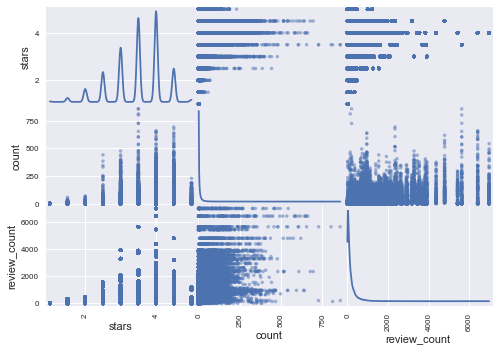


    <matplotlib.figure.Figure at 0x1354be93550>


```python
# To calculate the correlation between every two variables
corr = data.corr(method="pearson")
sns.heatmap(corr)
```


    <matplotlib.axes._subplots.AxesSubplot at 0x25a5517c5c0>


```python
corr
```


<div>
<style>
    .dataframe thead tr:only-child th {
        text-align: right;
    }

    .dataframe thead th {
        text-align: left;
    }

    .dataframe tbody tr th {
        vertical-align: top;
    }
</style>
<table border="1" class="dataframe">
  <thead>
    <tr style="text-align: right;">
      <th></th>
      <th>stars</th>
      <th>count</th>
      <th>review_count</th>
    </tr>
  </thead>
  <tbody>
    <tr>
      <th>stars</th>
      <td>1.000000</td>
      <td>0.153470</td>
      <td>0.215748</td>
    </tr>
    <tr>
      <th>count</th>
      <td>0.153470</td>
      <td>1.000000</td>
      <td>0.529276</td>
    </tr>
    <tr>
      <th>review_count</th>
      <td>0.215748</td>
      <td>0.529276</td>
      <td>1.000000</td>
    </tr>
  </tbody>
</table>
</div>


```python
sns.heatmap(corr)
```


    <matplotlib.axes._subplots.AxesSubplot at 0x25a5517c5c0>


```python
plt.show()
```


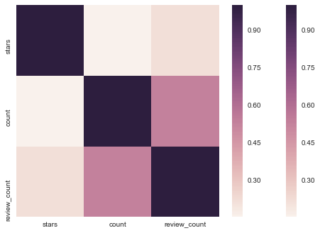


So basically, the first graph is showing us the relationship between each two of the variables like starts and count, count and review count, and stars and review count. For stars and count, as we can see from the graph, the majority star ratings are distributed at 2.5 to 4.5 stars. Among which, 3.5-star has the greatest rating counts. Almost the same thing happens to the relationship between stars and review_count, the majority reviews fall into range of 3 to 4.5, 4-star has the greatest review counts. For relationship between counts and review-count, review-counts under 4,000 are somehow evenly distributed, when revew-count exceed 4,000 some gaps appear.

From the correlation heatmap, we can see that the darker the color, the stronger the lorrelation. There are 4 very light squares in the graph, stars and count has the lighter color, which means they have the weakest relationship of 0.15347. Stars and review-count has a little bit stronger relationship of 0.215748. Count and review-count has the strongest relationship of 0.529276.

Though the correlation between stars and checkin count is not high, most restaurants with high checkin count or review count are high stars, which shows importance of high stars.

### Bar Chart of business's categories and its number (focusing on restaurants)

In this part, the bar chart would be used to explore the cetegories of restaurants and we wonder what kinds of categories account for larger proportion. 


```python
sql='''
    SELECT category,COUNT(*) AS Count
    FROM category
    JOIN restaurants 
    ON category.business_id = restaurants .id
    GROUP BY category
    ORDER BY Count DESC
    LIMIT 20;
    '''
```


```python
cate_count = pd.read_sql(sql,mydb)
```


```python
# The first row is restaurants so we delete it.
cate_count=cate_count[1:]
```


```python
import numpy as np
```


```python
plt.clf()
fig = plt.figure(figsize=[20,8])
ax2=fig.add_subplot(1,1,1)
ax2.set(title = 'Number Of Categories of Business',xlabel='Categories',ylabel='Number')
# Draw the bar chart
_ = ax2.bar(np.arange(len(cate_count)), height=np.array(cate_count['Count']),width=0.5,color='lightblue')
# Set the X label
ax2.set_xticks(np.arange(len(cate_count)))
ax2.set_xticklabels(cate_count['category'])
#Rotate the X label
for tick in ax2.get_xticklabels():
    tick.set_rotation(30)
```

The chart below indicates that top 5 categories are Food, Fast Food, Mexican, American(Traditional) and Sandwiches. In fact, our groups also feels that there are many restaurants of these cateories around us.


```python
plt.show()
```


    <matplotlib.figure.Figure at 0x1e6702a0320>


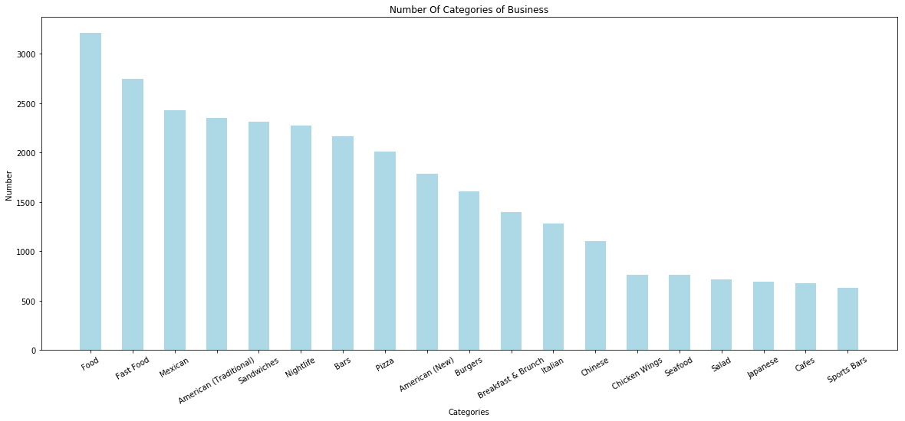


### Number of reviews of restaurants in West USA 


```python
#put the data into pandas dataframe
restaurant = pd.read_sql('select * from restaurants',mydb)
```


```python
#prepare for the count
first = 0 #first means the first segment for the pie chart.
second = 0
third = 0
forth = 0
fifth = 0
#start to count
for j in range(0,17103):
    if restaurant.review_count[j] <= 30:
        first = first + 1
    elif restaurant.review_count[j] <= 100:
            second = second + 1
    elif restaurant.review_count[j] <= 250:
            third = third + 1
    elif restaurant.review_count[j] <= 500:
            forth = forth + 1
    else:
        fifth = fifth + 1
```


```python
#use plotly to do offline drawing at notebook
plotly.offline.init_notebook_mode(connected=True)
#create labels and corresponding values
labels = ['less than 30','30-100','100-250','250-500','more than 500']
values = [first,second,third,forth,fifth]
#draw the pie chart and adding layout, which in this pie chart, title is enough
trace = go.Pie(labels=labels, values=values)
layout = go.Layout(title='Number of reviews for all restaurants in West USA')
#go to the entire figure and show the plot
fig = go.Figure(data=[trace], layout=layout)
plotly.offline.iplot(fig)
```


<script>requirejs.config({paths: { 'plotly': ['https://cdn.plot.ly/plotly-latest.min']},});if(!window.Plotly) {{require(['plotly'],function(plotly) {window.Plotly=plotly;});}}</script>


<div id="73a66ff4-4138-4a47-99ff-1c4f116c3d19" style="height: 525px; width: 100%;" class="plotly-graph-div"></div><script type="text/javascript">require(["plotly"], function(Plotly) { window.PLOTLYENV=window.PLOTLYENV || {};window.PLOTLYENV.BASE_URL="https://plot.ly";Plotly.newPlot("73a66ff4-4138-4a47-99ff-1c4f116c3d19", [{"type": "pie", "labels": ["less than 30", "30-100", "100-250", "250-500", "more than 500"], "values": [7923, 4554, 2856, 1167, 603]}], {"title": "Number of reviews for all restaurants in West USA"}, {"showLink": true, "linkText": "Export to plot.ly"})});</script>


```python
plt.clf()
fig = plt.figure(figsize=[10,8])
ax1=fig.add_subplot(1,1,1)
ax1.set(title = 'Number Of Reviews Business Received',xlabel='Count of Review',ylabel='Number')
ax1.set_xlim(0,200)
# Calculate the mean of number of reviews of business received.
ax1.axvline(restaurant['review_count'].mean(),color='r',linestyle='dashed')
_ = ax1.hist(restaurant['review_count'].values,bins=600,color='lightblue',edgecolor='black',alpha=0.3)
```


```python
plt.show()
```


    <matplotlib.figure.Figure at 0x2951e155240>


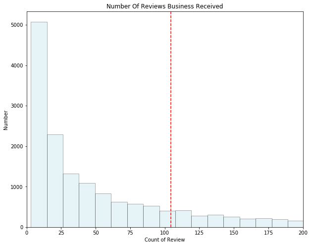


Apparently, most of the restaurants have number of review less than 30 or from 30 to 100. Only 3.53% of the restaurants are popular enough to receive over 500 reviews from customers.

### The number of reviews of different stars 

In this part, we will take a look at numbers of reviews of differents stars.


```python
sql='''
    SELECT review.stars,COUNT(*) AS Count
    FROM review
    JOIN restaurants 
    ON review.business_id = restaurants.id
    GROUP BY review.stars
    ORDER BY review.stars DESC;
    '''
```


```python
stars_r=pd.read_sql(sql,mydb)
```


```python
stars_r
```


<div>
<style>
    .dataframe thead tr:only-child th {
        text-align: right;
    }

    .dataframe thead th {
        text-align: left;
    }

    .dataframe tbody tr th {
        vertical-align: top;
    }
</style>
<table border="1" class="dataframe">
  <thead>
    <tr style="text-align: right;">
      <th></th>
      <th>stars</th>
      <th>Count</th>
    </tr>
  </thead>
  <tbody>
    <tr>
      <th>0</th>
      <td>5</td>
      <td>717789</td>
    </tr>
    <tr>
      <th>1</th>
      <td>4</td>
      <td>463297</td>
    </tr>
    <tr>
      <th>2</th>
      <td>3</td>
      <td>231117</td>
    </tr>
    <tr>
      <th>3</th>
      <td>2</td>
      <td>168116</td>
    </tr>
    <tr>
      <th>4</th>
      <td>1</td>
      <td>206864</td>
    </tr>
  </tbody>
</table>
</div>


```python
plt.clf()
fig = plt.figure(figsize=[8,8])
ax3=fig.add_subplot(1,1,1)
ax3.set(title = 'Stars Of Reviews',xlabel='Stars',ylabel='No. Of Reviews')
_ = ax3.bar(np.arange(len(stars_r)), height=np.array(stars_r['Count']),color='lightblue',width=0.3)
# Set the X label
ax3.set_xticks(np.arange(len(stars_r)))
ax3.set_xticklabels(stars_r['stars'])
```


    [<matplotlib.text.Text at 0x22c1c7c9f28>,
     <matplotlib.text.Text at 0x22c1c816f28>,
     <matplotlib.text.Text at 0x22c1c87c7b8>,
     <matplotlib.text.Text at 0x22c1c87cfd0>,
     <matplotlib.text.Text at 0x22c1c883828>]


The bar charts below shows that most of reviews are of 5 stars or 4 stars. Reviews of less than 4 stars are less.


```python
plt.show()
```


    <matplotlib.figure.Figure at 0x22c1903f4e0>


    <matplotlib.figure.Figure at 0x22c1903f588>


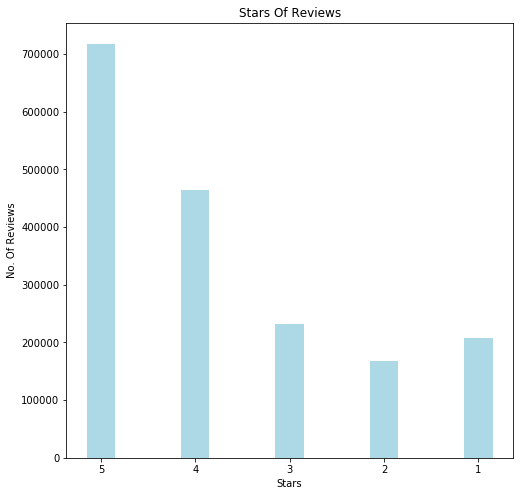


### Histogram of average stars of users


```python
sql='''
    SELECT average_stars
    FROM user;
    '''
```


```python
stars_user = pd.read_sql(sql,mydb)
```


```python
plt.clf()
fig = plt.figure(figsize=[10,10])
ax5=fig.add_subplot(1,1,1)
ax5.set(title = "Histogram Of Users' average stars",xlabel='average stars',ylabel='Number')
ax5.set_xlim(1,5)
# Calculate the average stars of users.
ax5.axvline(stars_user['average_stars'].mean(),color='r',linestyle='dashed')
_ = ax5.hist(stars_user['average_stars'].values,bins=50,color='lightblue',edgecolor='black',alpha=0.3)
```


```python
plt.show()
```


    <matplotlib.figure.Figure at 0x22c1c071860>


    <matplotlib.figure.Figure at 0x22c1c071828>


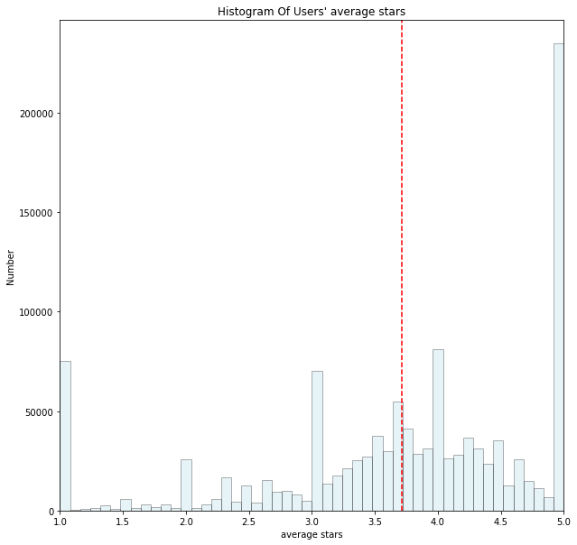


Based on two graphs above, we can conclude that most users are willing to rate in high stars, as long as restaurants could satisfy their requirements.

### Number of reviews for all users in USA


```python
reviewuser = pd.read_sql('select id, review_count from user', mydb) 
```


```python
#prepare for the count
first1 = 0 #first1 means the first segment for the pie chart.
second2 = 0
third3 = 0
forth4 = 0
fifth5 = 0
#start the count
for j in range(0,1183361):
    if reviewuser.review_count[j] <= 5:
        first1 = first1 + 1
    elif reviewuser.review_count[j] <= 15:
        second2 = second2 + 1
    elif reviewuser.review_count[j] <= 50:
        third3 = third3 + 1
    elif reviewuser.review_count[j] <= 100:
        forth4 = forth4 + 1
    else:
        fifth5 = fifth5 + 1
```


```python
#use plotly to do offline drawing at notebook
plotly.offline.init_notebook_mode(connected=True)
#create labels and corresponding values
labels1 = ['less than 5','5-15','15-50','50-100','more than 100']
values1 = [first1,second2,third3,forth4,fifth5]
#draw the pie chart and adding layout, which in this pie chart, title is enough
trace1 = go.Pie(labels=labels1, values=values1)
layout1 = go.Layout(title='Number of reviews for all yelp users in USA')
#go to the entire figure and show the plot
fig1 = go.Figure(data=[trace1], layout=layout1)
plotly.offline.iplot(fig1)
```


<script>requirejs.config({paths: { 'plotly': ['https://cdn.plot.ly/plotly-latest.min']},});if(!window.Plotly) {{require(['plotly'],function(plotly) {window.Plotly=plotly;});}}</script>


<div id="8bc84c0b-fee5-4562-a251-e686a12880df" style="height: 525px; width: 100%;" class="plotly-graph-div"></div><script type="text/javascript">require(["plotly"], function(Plotly) { window.PLOTLYENV=window.PLOTLYENV || {};window.PLOTLYENV.BASE_URL="https://plot.ly";Plotly.newPlot("8bc84c0b-fee5-4562-a251-e686a12880df", [{"type": "pie", "labels": ["less than 5", "5-15", "15-50", "50-100", "more than 100"], "values": [615809, 268507, 186899, 54543, 57603]}], {"title": "Number of reviews for all yelp users in USA"}, {"showLink": true, "linkText": "Export to plot.ly"})});</script>


```python
plt.clf()
fig = plt.figure(figsize=[8,8])
ax4=fig.add_subplot(1,1,1)
ax4.set(title = 'Number Of Reviews Users Sent',xlabel='Count of Review',ylabel='Number')
ax4.set_xlim(0,150)
# Calculate the average number of reviews users sent
ax4.axvline(reviewuser['review_count'].mean(),color='r',linestyle='dashed')
_ = ax4.hist(reviewuser['review_count'].values,bins=1000,color='lightblue',edgecolor='black',alpha=0.3)
```


```python
plt.show()
```


    <matplotlib.figure.Figure at 0x22c22309080>


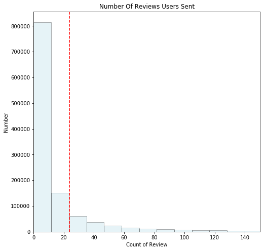


### Number of fans for all users in USA


```python
fans = pd.read_sql('select id, fans from user', mydb) 
```


```python
#prepare the count
first11 = 0  #first1 means the first segment for the pie chart.
second22 = 0
third33 = 0
forth44 = 0
#start to count
for j in range(0,1183361):
    if fans.fans[j] <= 0:
        first11 = first11 + 1
    elif fans.fans[j]  <= 5:
        second22 = second22 + 1
    elif fans.fans[j]  <= 100:
        third33 = third33 + 1
    else:
        forth44 = forth44 + 1
```


```python
#use plotly to do offline drawing at notebook
plotly.offline.init_notebook_mode(connected=True)
#create labels and corresponding values
labels2 = ['0','0-5','5-100','more than 100']
values2 = [first11,second22,third33,forth44]
#draw the pie chart and adding layout, which in this pie chart, title is enough
trace2 = go.Pie(labels=labels2, values=values2)
layout2 = go.Layout(title='Number of fans for all yelp users in USA')
#go to the entire figure and show the plot
fig2 = go.Figure(data=[trace2], layout=layout2)
plotly.offline.iplot(fig2)
```


<script>requirejs.config({paths: { 'plotly': ['https://cdn.plot.ly/plotly-latest.min']},});if(!window.Plotly) {{require(['plotly'],function(plotly) {window.Plotly=plotly;});}}</script>


<div id="d7cc60a6-30b0-48b1-b686-33984ef80390" style="height: 525px; width: 100%;" class="plotly-graph-div"></div><script type="text/javascript">require(["plotly"], function(Plotly) { window.PLOTLYENV=window.PLOTLYENV || {};window.PLOTLYENV.BASE_URL="https://plot.ly";Plotly.newPlot("d7cc60a6-30b0-48b1-b686-33984ef80390", [{"type": "pie", "labels": ["0", "0-5", "5-100", "more than 100"], "values": [915263, 215059, 51072, 1967]}], {"title": "Number of fans for all yelp users in USA"}, {"showLink": true, "linkText": "Export to plot.ly"})});</script>


### Word Cloud of different stars

First, wordcloud package needs to be installed.


```python
!pip install wordcloud
```

If this command doesn't work, please go through the following steps:
* Download the .whl file compatible with your Python version and your windows distribution (32bit or 64bit) from https://www.lfd.uci.edu/~gohlke/pythonlibs/#wordcloud
* cd to the file path
* Run this command :!pip install filename

#### Word Cloud of one star


```python
sql='''
    SELECT text
    FROM review
    JOIN restaurants 
    ON review.business_id = restaurants.id AND review.stars=1;
    '''
```


```python
onestar=pd.read_sql(sql,mydb)
```


```python
onestar.head(5)
```


<div>
<style>
    .dataframe thead tr:only-child th {
        text-align: right;
    }

    .dataframe thead th {
        text-align: left;
    }

    .dataframe tbody tr th {
        vertical-align: top;
    }
</style>
<table border="1" class="dataframe">
  <thead>
    <tr style="text-align: right;">
      <th></th>
      <th>text</th>
    </tr>
  </thead>
  <tbody>
    <tr>
      <th>0</th>
      <td>The fact that we were able to change our reser...</td>
    </tr>
    <tr>
      <th>1</th>
      <td>i have to admit, i had a bad experience at thi...</td>
    </tr>
    <tr>
      <th>2</th>
      <td>Service was Horrible, Food was Cold, Drinks we...</td>
    </tr>
    <tr>
      <th>3</th>
      <td>This was by far the worst meal I have ever had...</td>
    </tr>
    <tr>
      <th>4</th>
      <td>My family and business associates have visited...</td>
    </tr>
  </tbody>
</table>
</div>


```python
from wordcloud import WordCloud,STOPWORDS
```


```python
#generate the total stopwords based on the given stopwords set
stopwords = set(STOPWORDS)
stopwords.add("said")
stopwords.add("one")
stopwords.add("go")
stopwords.add("thru")
stopwords.add("also")
```


```python
wordcloud = WordCloud(background_color="white",width=2000,height=2000,stopwords=stopwords,margin=2).generate(' '.join(onestar['text']))
```


```python
#display the wordcloud
plt.clf()
plt.figure(figsize=[10,10])
plt.title("Word Cloud of Reviews for West USA Restaurant with 1 Stars")
plt.imshow(wordcloud)
plt.axis("off")
plt.show()
```


    <matplotlib.figure.Figure at 0x1925b2ee668>


#### Word Cloud of two star


```python
sql='''
    SELECT text
    FROM review
    JOIN restaurants 
    ON review.business_id = restaurants.id AND review.stars=2;
    '''
```


```python
twostar=pd.read_sql(sql,mydb)
```


```python
len(twostar)
```


    168116


```python
wordcloud = WordCloud(background_color="white",width=2000,height=2000,stopwords=stopwords,margin=2).generate(' '.join(twostar['text']))
```


```python
#display the wordcloud
plt.clf()
plt.figure(figsize=[10,10])
plt.title("Word Cloud of Reviews for West USA Restaurant with 2 Stars")
plt.imshow(wordcloud)
plt.axis("off")
plt.show()
```


    <matplotlib.figure.Figure at 0x1925b303860>


#### Word Cloud of three star


```python
sql='''
    SELECT text
    FROM review
    JOIN restaurants 
    ON review.business_id = restaurants.id AND review.stars=3;
    '''
```


```python
threestar=pd.read_sql(sql,mydb)
```


```python
wordcloud = WordCloud(background_color="white",width=2000,height=2000,stopwords=stopwords,margin=2).generate(' '.join(threestar['text']))
```


```python
#display the wordcloud
plt.clf()
plt.figure(figsize=[10,10])
plt.title("Word Cloud of Reviews for West USA Restaurant with 3 Stars")
plt.imshow(wordcloud)
plt.axis("off")
plt.show()
```


    <matplotlib.figure.Figure at 0x19222497240>


#### Word Cloud of four star


```python
sql='''
    SELECT text
    FROM review
    JOIN restaurants 
    ON review.business_id = restaurants.id AND review.stars=4;
    '''
```


```python
fourstar=pd.read_sql(sql,mydb)
```


```python
wordcloud = WordCloud(background_color="white",width=2000,height=2000,stopwords=stopwords,margin=2).generate(' '.join(fourstar['text']))
```


```python
#display the wordcloud
plt.clf()
plt.figure(figsize=[10,10])
plt.title("Word Cloud of Reviews for West USA Restaurant with 4 Stars")
plt.imshow(wordcloud)
plt.axis("off")
plt.show()
```


    <matplotlib.figure.Figure at 0x1920ad7a128>


#### Word Cloud of five star


```python
sql='''
    SELECT text
    FROM review
    JOIN restaurants 
    ON review.business_id = restaurants.id AND review.stars=5;
    '''
```


```python
fivestar=pd.read_sql(sql,mydb)
```


```python
wordcloud = WordCloud(background_color="white",width=2000,height=2000,stopwords=stopwords,margin=2).generate(' '.join(fivestar['text']))
```


```python
#display the wordcloud
plt.clf()
plt.figure(figsize=[10,10])
plt.title("Word Cloud of Reviews for West USA Restaurant with 5 Stars")
plt.imshow(wordcloud)
plt.axis("off")
plt.show()
```


    <matplotlib.figure.Figure at 0x22c405e4240>


The wordcloud above indicates customer service plays an signficant roles in reviews of less than 2 stars. If we want to get reviews of more than 3 stars, it is essential to improve food.

### Word Cloud of Tips for West USA Restaurant with Star Less Than 2(for compared use)


```python
#Select the tips which belongs to the restaurants with less than 2 stars and located in West USA from tip table. 
tiplessthan2 = pd.read_sql('select tip.text from tip, restaurants where tip.business_id = restaurants.id and restaurants.stars <= 2',mydb)
```


```python
#Connect all the tips and save into a string called 'ti'.
ti = ' '
for i in range(0,8545,1):
    ti = ti + tiplessthan2.text[i]
```


```python
from os import path
from PIL import Image
import numpy as np

#We set a burger meal as the mask picture.
mask = np.array(Image.open("new1.jpg"))

#set up the background and mask figure, add the stopwords filter
#in this picture we only want to see the most frequent 200 words
wc = WordCloud(background_color="white", max_words=200,mask=mask,
               stopwords=stopwords)
# generate word cloud
wc.generate(ti)
# show the wordcloud figure and add title
plt.figure(figsize=[10,10])
plt.imshow(wc, interpolation='bilinear')
plt.axis("off")
plt.title("Word Cloud of Tips for West USA Restaurant with Star Less Than 2")
plt.show()
```


### Word Cloud of Tips for West USA Restaurant with Star From 2 to 4(for compared use)


```python
#Select the tips which belongs to the restaurants with 2 stars to 4 stars and located in West USA from tip table. 
tip2to4 = pd.read_sql('select tip.text from tip, restaurants where tip.business_id = restaurants.id and restaurants.stars > 2 and restaurants.stars <= 4',mydb)
```


```python
#Connect all the tips and save into a string called 'tii'.
tii = ' '
for i in range(0,379913,1):
    tii = tii + tip2to4.text[i]
```


```python
#set up the background and mask figure, add the stopwords filter
#in this picture we only want to see the most frequent 200 words
wc = WordCloud(background_color="white", max_words=200,mask=mask,
               stopwords=stopwords)
# generate word cloud
wc.generate(tii)
# show the wordcloud figure and add title
plt.figure(figsize=[10,10])
plt.imshow(wc, interpolation='bilinear')
plt.axis("off")
plt.title("Word Cloud of Tips for West USA Restaurant with Star From 2 To 4")
plt.show()
```


By comparing these two wordcloud pictures, there are some conclusions we can draw from that. 

In figure 'star 2-4', some words like 'great service', 'good food', 'happy hour' and 'food great' are the most obvious words. Some like 'best', 'love', 'try', 'delcious', 'amazing' and 'happy hour' are the second noticable words. Look even closer, it is hard to see some negative tips.

In contrast, for the figure 'star less than 2', although some of the word are the same, like 'food', 'location', 'place' and 'drive'. None of them are assciate with a positive adjective so it is hard for us to know whether these are complains or praises. Look into more details, we saw some words like 'worst', 'bad', 'never', 'wait' and 'horrible'. We inferred that some people may be unhappy about the survice and food, or get annoyed to wait for a longer time, which make a restaurant become a 2-star one.

### Word Cloud of Tips for West USA Restaurant with Star Less than 2 (for suggestion use)

In this part, we want to know what tips are given to the restaurants with star less than 2 from a suggestion view. We want to find what kind of charactors lead to complains of customers.


```python

#add some positive wordson the given stopwords set
stopwords = set(STOPWORDS)
stopwords.add("food")
stopwords.add("good")
stopwords.add("place")
stopwords.add("order")
stopwords.add("great")
stopwords.add("chicken")
stopwords.add("pizza")
stopwords.add("love")
stopwords.add("best")
#set up the background and mask figure, add the stopwords filter
#in this picture we only want to see the most frequent 200 words
wc = WordCloud(background_color="white", max_words=150,mask=mask,
               stopwords=stopwords)
# generate word cloud
wc.generate(ti)
# show the wordcloud figure and add title
plt.figure(figsize=[10,10])
plt.imshow(wc, interpolation='bilinear')
plt.axis("off")
plt.title("Word Cloud of Tips for West USA Restaurant with Star Less Than 2")
plt.show()
```


About the noun words, we found customers are actually more care about service, location and drink. About the verb, we saw drive, come, taste, want and wait. About the adjective and adverbial, we saw always, bad, slow, clean, never, worst and rude. In total, our preliminary suggestions for restaurants is to find a more accessible location, improve the customer service by being polite and patient to customers and increase the responding or serving speed. What's more, make your food delicious and make the environment tidy.

### Heatmap for the busiest time weekly and daily

In this part, we want to see from monday to sunday and from morning to midnight, which period is more popular based on the checkin data in the checkin table. So the restaurant is able to forsee the potantial rush hour for a burst customer and make corresponding adjustment to the raw-material and labor-resourse.

According to the generally accepted knowledge, morning is 6:00-11:59, afternoon is 12:00-17:59, evening is 18:00-23:59, and night is 00:00-5:59.


```python
#select the monday data
monday = pd.read_sql('select checkin.date from checkin,restaurants where checkin.business_id = restaurants.id and checkin.date like "Monday%"',mydb)
```


```python
#create an empty list to contain all the time data
list11 = []
for i in monday.index:
    list11.append(monday.date[i].split('-')[1])#because the format of date is 'Monday-00:00', need to be seperated by '-'
#create an empty list to eliminate ':'.
list12 = []
for i in monday.index:
    list12.append(list11[i].replace(':',''))
#convert time to numeric is easy to compare in our case
#change the str to integer
list1 = [int(i) for i in list12]
monday['time'] = list1
#prepare to count; For example,morning1 means monday morning.
morning1 = 0
night1 = 0
evening1 = 0
afternoon1 = 0
#start to count
for i in monday.index: 
    if int(monday.time[i]) < 600 :
        night1 = night1 + 1
    elif int(monday.time[i]) < 1200:
        morning1 = morning1 + 1
    elif int(monday.time[i]) < 1800:
        afternoon1 = afternoon1 + 1
    elif int(monday.time[i]) < 2400:
        evening1 = evening1 + 1
```


```python
#for the following cells untill the ploting one is nearly the same. 
#we need to run the cell bufore 7 times to get all data 7 days in a week
tuesday = pd.read_sql('select checkin.date from checkin,restaurants where checkin.business_id = restaurants.id and checkin.date like "Tuesday%"',mydb)
```


```python
list21 = []
for i in tuesday.index:
    list21.append(tuesday.date[i].split('-')[1])

list22 = []
for i in tuesday.index:
    list22.append(list21[i].replace(':',''))

list2 = [int(i) for i in list22]
tuesday['time'] = list2

morning2 = 0
night2 = 0
evening2 = 0
afternoon2 = 0

for i in tuesday.index: 
    if int(tuesday.time[i]) < 600 :
        night2 = night2 + 1
    elif int(tuesday.time[i]) < 1200:
        morning2 = morning2 + 1
    elif int(tuesday.time[i]) < 1800:
        afternoon2 = afternoon2 + 1
    elif int(tuesday.time[i]) < 2400:
        evening2 = evening2 + 1
```


```python
#wednesday
wednesday = pd.read_sql('select checkin.date from checkin,restaurants where checkin.business_id = restaurants.id and checkin.date like "Wednesday%"',mydb)
```


```python
list31 = []
for i in wednesday.index:
    list31.append(wednesday.date[i].split('-')[1])

list32 = []
for i in wednesday.index:
    list32.append(list31[i].replace(':',''))

list3 = [int(i) for i in list32]
wednesday['time'] = list3

morning3 = 0
night3 = 0
evening3 = 0
afternoon3 = 0

for i in wednesday.index: 
    if int(wednesday.time[i]) < 600 :
        night3 = night3 + 1
    elif int(wednesday.time[i]) < 1200:
        morning3 = morning3 + 1
    elif int(wednesday.time[i]) < 1800:
        afternoon3 = afternoon3 + 1
    elif int(wednesday.time[i]) < 2400:
        evening3 = evening3 + 1

```


```python
#thursday
thursday = pd.read_sql('select checkin.date from checkin,restaurants where checkin.business_id = restaurants.id and checkin.date like "Thursday%"',mydb)
```


```python
list41 = []
for i in thursday.index:
    list41.append(thursday.date[i].split('-')[1])

list42 = []
for i in thursday.index:
    list42.append(list41[i].replace(':',''))

list4 = [int(i) for i in list42]
thursday['time'] = list4

morning4 = 0
night4 = 0
evening4 = 0
afternoon4 = 0

for i in thursday.index: 
    if int(thursday.time[i]) < 600 :
        night4 = night4 + 1
    elif int(thursday.time[i]) < 1200:
        morning4 = morning4 + 1
    elif int(thursday.time[i]) < 1800:
        afternoon4 = afternoon4 + 1
    elif int(thursday.time[i]) < 2400:
        evening4 = evening4 + 1
```


```python
#friday
friday = pd.read_sql('select checkin.date from checkin,restaurants where checkin.business_id = restaurants.id and checkin.date like "Friday%"',mydb)
```


```python
list51 = []
for i in friday.index:
    list51.append(friday.date[i].split('-')[1])

list52 = []
for i in friday.index:
    list52.append(list51[i].replace(':',''))

list5 = [int(i) for i in list52]
friday['time'] = list5

morning5 = 0
night5 = 0
evening5 = 0
afternoon5 = 0

for i in friday.index: 
    if int(friday.time[i]) < 600 :
        night5 = night5 + 1
    elif int(friday.time[i]) < 1200:
        morning5 = morning5 + 1
    elif int(friday.time[i]) < 1800:
        afternoon5 = afternoon5 + 1
    elif int(friday.time[i]) < 2400:
        evening5 = evening5 + 1
```


```python
#saturday
saturday = pd.read_sql('select checkin.date from checkin,restaurants where checkin.business_id = restaurants.id and checkin.date like "Saturday%"',mydb)
```


```python
list61 = []
for i in saturday.index:
    list61.append(saturday.date[i].split('-')[1])

list62 = []
for i in saturday.index:
    list62.append(list61[i].replace(':',''))

list6 = [int(i) for i in list62]
saturday['time'] = list6

morning6 = 0
night6 = 0
evening6 = 0
afternoon6 = 0

for i in saturday.index: 
    if int(saturday.time[i]) < 600 :
        night6 = night6 + 1
    elif int(saturday.time[i]) < 1200:
        morning6 = morning6 + 1
    elif int(saturday.time[i]) < 1800:
        afternoon6 = afternoon6 + 1
    elif int(saturday.time[i]) < 2400:
        evening6 = evening6 + 1
```


```python
#sunday
sunday = pd.read_sql('select checkin.date from checkin,restaurants where checkin.business_id = restaurants.id and checkin.date like "Sunday%"',mydb)
```


```python
list71 = []
for i in sunday.index:
    list71.append(sunday.date[i].split('-')[1])

list72 = []
for i in sunday.index:
    list72.append(list71[i].replace(':',''))

list7 = [int(i) for i in list72]
sunday['time'] = list7

morning7 = 0
night7 = 0
evening7 = 0
afternoon7 = 0

for i in sunday.index: 
    if int(sunday.time[i]) < 600 :
        night7 = night7 + 1
    elif int(sunday.time[i]) < 1200:
        morning7 = morning7 + 1
    elif int(sunday.time[i]) < 1800:
        afternoon7 = afternoon7 + 1
    elif int(sunday.time[i]) < 2400:
        evening7 = evening7 + 1
```


```python
#put all count result into the relevant list
nightcount = [night1,night2,night3,night4,night5,night6,night7]#this means the night count from monday to sunday
morningcount = [morning1,morning2,morning3,morning4,morning5,morning6,morning7]
eveningcount = [evening1,evening2,evening3,evening4,evening5,evening6,evening7]
afternooncount = [afternoon1,afternoon2,afternoon3,afternoon4,afternoon5,afternoon6,afternoon7]
```


```python
import plotly

plotly.offline.init_notebook_mode(connected=True)

heat = go.Heatmap(z=[morningcount,afternooncount,eveningcount,nightcount],
                   x=['Monday', 'Tuesday', 'Wednesday', 'Thursday', 'Friday','Saturday','Sunday'],
                   y=['Morning', 'Afternoon', 'Evening','Night'],)
data=[heat]
layout = go.Layout(title='Heatmap of Check-in Customers Weekly and Daily')
fig = go.Figure(data=data, layout=layout)

plotly.offline.iplot(fig)
```


<script>requirejs.config({paths: { 'plotly': ['https://cdn.plot.ly/plotly-latest.min']},});if(!window.Plotly) {{require(['plotly'],function(plotly) {window.Plotly=plotly;});}}</script>


<div id="38fc23a6-7c77-4143-b0b1-9d9047a6db24" style="height: 525px; width: 100%;" class="plotly-graph-div"></div><script type="text/javascript">require(["plotly"], function(Plotly) { window.PLOTLYENV=window.PLOTLYENV || {};window.PLOTLYENV.BASE_URL="https://plot.ly";Plotly.newPlot("38fc23a6-7c77-4143-b0b1-9d9047a6db24", [{"type": "heatmap", "z": [[10018, 9464, 9768, 9926, 10919, 14710, 15111], [16442, 16524, 16862, 17401, 18162, 19400, 17873], [50739, 51100, 51858, 52255, 54742, 57644, 53554], [44607, 45687, 47360, 48204, 49595, 54206, 53131]], "x": ["Monday", "Tuesday", "Wednesday", "Thursday", "Friday", "Saturday", "Sunday"], "y": ["Morning", "Afternoon", "Evening", "Night"]}], {"title": "Heatmap of Check-in Customers Weekly and Daily"}, {"showLink": true, "linkText": "Export to plot.ly"})});</script>


From the color bar, color heat goes up when the number of checkin people is large and goes down when that is small. It is clear that in afternoon and morning, from 6:00-17:59 in total, is less popular than evening and night, from 18:00 to 5:59 of the next day. Especially, morning is the time period that the restaurant tend to be more empty from monday to sunday. Saturday evening is the most lively time slot. 

### The relationship between location and success of business

Next, we will load data of top 50 and least 50 review count, stars and check-in count in both cities from our database.

##### Phoneix in AZ

Top 50 review_count


```python
sql='''
    SELECT latitude,longitude,review_count
    FROM restaurants
    WHERE state = 'AZ' and city = 'Phoenix'
    ORDER BY review_count DESC
    LIMIT 50;
    '''
```


```python
Top_review_AZ = pd.read_sql(sql,mydb)
```


```python
Top_review_AZ.head()
```


<div>
<style>
    .dataframe thead tr:only-child th {
        text-align: right;
    }

    .dataframe thead th {
        text-align: left;
    }

    .dataframe tbody tr th {
        vertical-align: top;
    }
</style>
<table border="1" class="dataframe">
  <thead>
    <tr style="text-align: right;">
      <th></th>
      <th>latitude</th>
      <th>longitude</th>
      <th>review_count</th>
    </tr>
  </thead>
  <tbody>
    <tr>
      <th>0</th>
      <td>33.4492</td>
      <td>-112.066</td>
      <td>1899</td>
    </tr>
    <tr>
      <th>1</th>
      <td>33.5611</td>
      <td>-112.116</td>
      <td>1691</td>
    </tr>
    <tr>
      <th>2</th>
      <td>33.5006</td>
      <td>-112.074</td>
      <td>1671</td>
    </tr>
    <tr>
      <th>3</th>
      <td>33.4550</td>
      <td>-112.080</td>
      <td>1602</td>
    </tr>
    <tr>
      <th>4</th>
      <td>33.4692</td>
      <td>-112.047</td>
      <td>1534</td>
    </tr>
  </tbody>
</table>
</div>


Least 50 review_count


```python
sql='''
    SELECT latitude,longitude,review_count
    FROM restaurants
    WHERE state = 'AZ' and city = 'Phoenix'
    ORDER BY review_count
    LIMIT 50;
    '''
```


```python
Lea_review_AZ = pd.read_sql(sql,mydb)
```


```python
Lea_review_AZ.head()
```


<div>
<style>
    .dataframe thead tr:only-child th {
        text-align: right;
    }

    .dataframe thead th {
        text-align: left;
    }

    .dataframe tbody tr th {
        vertical-align: top;
    }
</style>
<table border="1" class="dataframe">
  <thead>
    <tr style="text-align: right;">
      <th></th>
      <th>latitude</th>
      <th>longitude</th>
      <th>review_count</th>
    </tr>
  </thead>
  <tbody>
    <tr>
      <th>0</th>
      <td>33.5533</td>
      <td>-112.111</td>
      <td>3</td>
    </tr>
    <tr>
      <th>1</th>
      <td>33.3774</td>
      <td>-112.071</td>
      <td>3</td>
    </tr>
    <tr>
      <th>2</th>
      <td>33.4720</td>
      <td>-112.221</td>
      <td>3</td>
    </tr>
    <tr>
      <th>3</th>
      <td>33.6557</td>
      <td>-112.012</td>
      <td>3</td>
    </tr>
    <tr>
      <th>4</th>
      <td>33.7998</td>
      <td>-112.066</td>
      <td>3</td>
    </tr>
  </tbody>
</table>
</div>


```python
import matplotlib.pyplot as plt
```

Top 50 stars


```python
sql='''
    SELECT latitude,longitude,stars
    FROM restaurants
    WHERE state = 'AZ' and city = 'Phoenix'
    ORDER BY stars DESC
    LIMIT 50;
    '''
```


```python
Top_stars_AZ = pd.read_sql(sql,mydb)
```


```python
Top_stars_AZ.head()
```


<div>
<style>
    .dataframe thead tr:only-child th {
        text-align: right;
    }

    .dataframe thead th {
        text-align: left;
    }

    .dataframe tbody tr th {
        vertical-align: top;
    }
</style>
<table border="1" class="dataframe">
  <thead>
    <tr style="text-align: right;">
      <th></th>
      <th>latitude</th>
      <th>longitude</th>
      <th>stars</th>
    </tr>
  </thead>
  <tbody>
    <tr>
      <th>0</th>
      <td>33.5675</td>
      <td>-112.056</td>
      <td>5.0</td>
    </tr>
    <tr>
      <th>1</th>
      <td>33.4800</td>
      <td>-112.077</td>
      <td>5.0</td>
    </tr>
    <tr>
      <th>2</th>
      <td>33.4321</td>
      <td>-112.048</td>
      <td>5.0</td>
    </tr>
    <tr>
      <th>3</th>
      <td>33.4813</td>
      <td>-112.202</td>
      <td>5.0</td>
    </tr>
    <tr>
      <th>4</th>
      <td>33.5016</td>
      <td>-112.100</td>
      <td>5.0</td>
    </tr>
  </tbody>
</table>
</div>


Least 50 stars


```python
sql='''
    SELECT latitude,longitude,stars
    FROM restaurants
    WHERE state = 'AZ' and city = 'Phoenix'
    ORDER BY stars
    LIMIT 50;
    '''
```


```python
Lea_stars_AZ = pd.read_sql(sql,mydb)
```


```python
Lea_stars_AZ.head()
```


<div>
<style>
    .dataframe thead tr:only-child th {
        text-align: right;
    }

    .dataframe thead th {
        text-align: left;
    }

    .dataframe tbody tr th {
        vertical-align: top;
    }
</style>
<table border="1" class="dataframe">
  <thead>
    <tr style="text-align: right;">
      <th></th>
      <th>latitude</th>
      <th>longitude</th>
      <th>stars</th>
    </tr>
  </thead>
  <tbody>
    <tr>
      <th>0</th>
      <td>33.6261</td>
      <td>-112.014</td>
      <td>1.0</td>
    </tr>
    <tr>
      <th>1</th>
      <td>33.4768</td>
      <td>-112.220</td>
      <td>1.0</td>
    </tr>
    <tr>
      <th>2</th>
      <td>33.4936</td>
      <td>-112.169</td>
      <td>1.0</td>
    </tr>
    <tr>
      <th>3</th>
      <td>33.5075</td>
      <td>-112.040</td>
      <td>1.0</td>
    </tr>
    <tr>
      <th>4</th>
      <td>33.3894</td>
      <td>-112.134</td>
      <td>1.0</td>
    </tr>
  </tbody>
</table>
</div>


Top 50 checkin


```python
sql='''
    SELECT business_id, restaurants.latitude,restaurants.longitude,ROUND(AVG(checkin.count),2) AS checkin
    FROM checkin
    JOIN restaurants
    ON restaurants.id = checkin.business_id AND
    state = 'AZ' and city = 'Phoenix'
    GROUP BY business_id,restaurants.latitude,restaurants.longitude
    ORDER BY ROUND(AVG(checkin.count),2) DESC
    LIMIT 50;
    '''
```


```python
Top_checkin_AZ = pd.read_sql(sql,mydb)
```


```python
Top_checkin_AZ.head()
```


<div>
<style>
    .dataframe thead tr:only-child th {
        text-align: right;
    }

    .dataframe thead th {
        text-align: left;
    }

    .dataframe tbody tr th {
        vertical-align: top;
    }
</style>
<table border="1" class="dataframe">
  <thead>
    <tr style="text-align: right;">
      <th></th>
      <th>business_id</th>
      <th>latitude</th>
      <th>longitude</th>
      <th>checkin</th>
    </tr>
  </thead>
  <tbody>
    <tr>
      <th>0</th>
      <td>OgJ0KxwJcJ9R5bUK0ixCbg</td>
      <td>33.5006</td>
      <td>-112.074</td>
      <td>70.88</td>
    </tr>
    <tr>
      <th>1</th>
      <td>mnwRtuVQEsIUomBchu0gwg</td>
      <td>33.4950</td>
      <td>-111.976</td>
      <td>58.08</td>
    </tr>
    <tr>
      <th>2</th>
      <td>cTJjTKz2huGZ-ElScC2pSw</td>
      <td>33.5136</td>
      <td>-112.073</td>
      <td>52.67</td>
    </tr>
    <tr>
      <th>3</th>
      <td>D3dAx-QW_uuClz4MambeHA</td>
      <td>33.5023</td>
      <td>-111.996</td>
      <td>51.93</td>
    </tr>
    <tr>
      <th>4</th>
      <td>N5B7OBTyNGgwU_Y2fwNcyw</td>
      <td>33.4558</td>
      <td>-112.074</td>
      <td>51.66</td>
    </tr>
  </tbody>
</table>
</div>


Least 50 checkin


```python
sql='''
    SELECT business_id, restaurants.latitude,restaurants.longitude,ROUND(AVG(checkin.count),2) AS checkin
    FROM checkin
    JOIN restaurants
    ON restaurants.id = checkin.business_id AND
    state = 'AZ' and city = 'Phoenix'
    GROUP BY business_id,restaurants.latitude,restaurants.longitude
    ORDER BY ROUND(AVG(checkin.count),2)
    LIMIT 50;
    '''
```


```python
Lea_checkin_AZ = pd.read_sql(sql,mydb)
```


```python
Lea_checkin_AZ.head()
```


<div>
<style>
    .dataframe thead tr:only-child th {
        text-align: right;
    }

    .dataframe thead th {
        text-align: left;
    }

    .dataframe tbody tr th {
        vertical-align: top;
    }
</style>
<table border="1" class="dataframe">
  <thead>
    <tr style="text-align: right;">
      <th></th>
      <th>business_id</th>
      <th>latitude</th>
      <th>longitude</th>
      <th>checkin</th>
    </tr>
  </thead>
  <tbody>
    <tr>
      <th>0</th>
      <td>zvsJSNdg9UXEIL6FKiGa3Q</td>
      <td>33.4960</td>
      <td>-112.152</td>
      <td>1.0</td>
    </tr>
    <tr>
      <th>1</th>
      <td>b9kQOV8VK_ecGYVoIQiHrg</td>
      <td>33.4454</td>
      <td>-112.067</td>
      <td>1.0</td>
    </tr>
    <tr>
      <th>2</th>
      <td>uUIYh3iKyYKzbhl7ORYxVA</td>
      <td>33.5965</td>
      <td>-112.015</td>
      <td>1.0</td>
    </tr>
    <tr>
      <th>3</th>
      <td>g-neBWSgkVEKVVUwl3iXwg</td>
      <td>33.4951</td>
      <td>-111.989</td>
      <td>1.0</td>
    </tr>
    <tr>
      <th>4</th>
      <td>G3dMzC98ZiTdPGpynfCJTg</td>
      <td>33.3793</td>
      <td>-112.182</td>
      <td>1.0</td>
    </tr>
  </tbody>
</table>
</div>


##### Las Vegas, NV

Top 50 review_count


```python
sql='''
    SELECT latitude,longitude,review_count
    FROM restaurants
    WHERE state = 'NV' AND city = 'Las Vegas'
    ORDER BY review_count DESC
    LIMIT 50;
    '''
```


```python
Top_review_NV = pd.read_sql(sql,mydb)
Top_review_NV.head()
```


<div>
<style>
    .dataframe thead tr:only-child th {
        text-align: right;
    }

    .dataframe thead th {
        text-align: left;
    }

    .dataframe tbody tr th {
        vertical-align: top;
    }
</style>
<table border="1" class="dataframe">
  <thead>
    <tr style="text-align: right;">
      <th></th>
      <th>latitude</th>
      <th>longitude</th>
      <th>review_count</th>
    </tr>
  </thead>
  <tbody>
    <tr>
      <th>0</th>
      <td>36.1128</td>
      <td>-115.173</td>
      <td>6979</td>
    </tr>
    <tr>
      <th>1</th>
      <td>36.1161</td>
      <td>-115.176</td>
      <td>6417</td>
    </tr>
    <tr>
      <th>2</th>
      <td>36.1094</td>
      <td>-115.176</td>
      <td>5632</td>
    </tr>
    <tr>
      <th>3</th>
      <td>36.1107</td>
      <td>-115.172</td>
      <td>5429</td>
    </tr>
    <tr>
      <th>4</th>
      <td>36.1094</td>
      <td>-115.172</td>
      <td>4789</td>
    </tr>
  </tbody>
</table>
</div>


```python
sql='''
    SELECT latitude,longitude,review_count
    FROM restaurants
    WHERE state = 'NV' AND city = 'Las Vegas'
    ORDER BY review_count
    LIMIT 50;
    '''
```


```python
Lea_review_NV = pd.read_sql(sql,mydb)
Lea_review_NV.head()
```


<div>
<style>
    .dataframe thead tr:only-child th {
        text-align: right;
    }

    .dataframe thead th {
        text-align: left;
    }

    .dataframe tbody tr th {
        vertical-align: top;
    }
</style>
<table border="1" class="dataframe">
  <thead>
    <tr style="text-align: right;">
      <th></th>
      <th>latitude</th>
      <th>longitude</th>
      <th>review_count</th>
    </tr>
  </thead>
  <tbody>
    <tr>
      <th>0</th>
      <td>36.2030</td>
      <td>-115.242</td>
      <td>3</td>
    </tr>
    <tr>
      <th>1</th>
      <td>36.1939</td>
      <td>-115.192</td>
      <td>3</td>
    </tr>
    <tr>
      <th>2</th>
      <td>36.0566</td>
      <td>-115.065</td>
      <td>3</td>
    </tr>
    <tr>
      <th>3</th>
      <td>36.1520</td>
      <td>-115.244</td>
      <td>3</td>
    </tr>
    <tr>
      <th>4</th>
      <td>36.2016</td>
      <td>-115.195</td>
      <td>3</td>
    </tr>
  </tbody>
</table>
</div>


Top 50 stars


```python
sql='''
    SELECT latitude,longitude,stars
    FROM restaurants
    WHERE state = 'NV' AND city = 'Las Vegas'
    ORDER BY stars DESC
    LIMIT 50;
    '''
```


```python
Top_stars_NV = pd.read_sql(sql,mydb)
```


```python
Top_stars_NV.head()
```


<div>
<style>
    .dataframe thead tr:only-child th {
        text-align: right;
    }

    .dataframe thead th {
        text-align: left;
    }

    .dataframe tbody tr th {
        vertical-align: top;
    }
</style>
<table border="1" class="dataframe">
  <thead>
    <tr style="text-align: right;">
      <th></th>
      <th>latitude</th>
      <th>longitude</th>
      <th>stars</th>
    </tr>
  </thead>
  <tbody>
    <tr>
      <th>0</th>
      <td>36.3065</td>
      <td>-115.284</td>
      <td>5.0</td>
    </tr>
    <tr>
      <th>1</th>
      <td>36.1586</td>
      <td>-115.237</td>
      <td>5.0</td>
    </tr>
    <tr>
      <th>2</th>
      <td>36.1017</td>
      <td>-115.100</td>
      <td>5.0</td>
    </tr>
    <tr>
      <th>3</th>
      <td>36.1148</td>
      <td>-115.207</td>
      <td>5.0</td>
    </tr>
    <tr>
      <th>4</th>
      <td>36.1040</td>
      <td>-115.183</td>
      <td>5.0</td>
    </tr>
  </tbody>
</table>
</div>


Least 50 stars


```python
sql='''
    SELECT latitude,longitude,stars
    FROM restaurants
    WHERE state = 'NV' AND city = 'Las Vegas'
    ORDER BY stars
    LIMIT 50;
    '''
```


```python
Lea_stars_NV = pd.read_sql(sql,mydb)
```


```python
Lea_stars_NV.head()
```


<div>
<style>
    .dataframe thead tr:only-child th {
        text-align: right;
    }

    .dataframe thead th {
        text-align: left;
    }

    .dataframe tbody tr th {
        vertical-align: top;
    }
</style>
<table border="1" class="dataframe">
  <thead>
    <tr style="text-align: right;">
      <th></th>
      <th>latitude</th>
      <th>longitude</th>
      <th>stars</th>
    </tr>
  </thead>
  <tbody>
    <tr>
      <th>0</th>
      <td>36.1464</td>
      <td>-115.065</td>
      <td>1.0</td>
    </tr>
    <tr>
      <th>1</th>
      <td>36.1360</td>
      <td>-115.163</td>
      <td>1.0</td>
    </tr>
    <tr>
      <th>2</th>
      <td>36.1807</td>
      <td>-115.180</td>
      <td>1.0</td>
    </tr>
    <tr>
      <th>3</th>
      <td>36.1145</td>
      <td>-115.169</td>
      <td>1.0</td>
    </tr>
    <tr>
      <th>4</th>
      <td>36.1977</td>
      <td>-115.247</td>
      <td>1.0</td>
    </tr>
  </tbody>
</table>
</div>


Top 50 checkin


```python
sql='''
    SELECT business_id, restaurants.latitude,restaurants.longitude,ROUND(AVG(checkin.count),2) AS checkin
    FROM checkin
    JOIN restaurants
    ON restaurants.id = checkin.business_id AND
    state = 'NV' AND city = 'Las Vegas'
    GROUP BY business_id,restaurants.latitude,restaurants.longitude
    ORDER BY ROUND(AVG(checkin.count),2) DESC
    LIMIT 50;
    '''
```


```python
Top_checkin_NV = pd.read_sql(sql,mydb)
```


```python
Top_checkin_NV.head()
```


<div>
<style>
    .dataframe thead tr:only-child th {
        text-align: right;
    }

    .dataframe thead th {
        text-align: left;
    }

    .dataframe tbody tr th {
        vertical-align: top;
    }
</style>
<table border="1" class="dataframe">
  <thead>
    <tr style="text-align: right;">
      <th></th>
      <th>business_id</th>
      <th>latitude</th>
      <th>longitude</th>
      <th>checkin</th>
    </tr>
  </thead>
  <tbody>
    <tr>
      <th>0</th>
      <td>IZivKqtHyz4-ts8KsnvMrA</td>
      <td>36.1270</td>
      <td>-115.210</td>
      <td>207.39</td>
    </tr>
    <tr>
      <th>1</th>
      <td>El4FC8jcawUVgw_0EIcbaQ</td>
      <td>36.1022</td>
      <td>-115.170</td>
      <td>164.38</td>
    </tr>
    <tr>
      <th>2</th>
      <td>RESDUcs7fIiihp38-d6_6g</td>
      <td>36.1161</td>
      <td>-115.176</td>
      <td>150.80</td>
    </tr>
    <tr>
      <th>3</th>
      <td>DkYS3arLOhA8si5uUEmHOw</td>
      <td>36.1094</td>
      <td>-115.172</td>
      <td>147.81</td>
    </tr>
    <tr>
      <th>4</th>
      <td>K7lWdNUhCbcnEvI0NhGewg</td>
      <td>36.1094</td>
      <td>-115.176</td>
      <td>126.80</td>
    </tr>
  </tbody>
</table>
</div>


Least 50 checkin


```python
sql='''
    SELECT business_id, restaurants.latitude,restaurants.longitude,ROUND(AVG(checkin.count),2) AS checkin
    FROM checkin
    JOIN restaurants
    ON restaurants.id = checkin.business_id AND
    state = 'NV' AND city = 'Las Vegas'
    GROUP BY business_id,restaurants.latitude,restaurants.longitude
    ORDER BY ROUND(AVG(checkin.count),2)
    LIMIT 50;
    '''
```


```python
Lea_checkin_NV = pd.read_sql(sql,mydb)
```


```python
Lea_checkin_NV.head()
```


<div>
<style>
    .dataframe thead tr:only-child th {
        text-align: right;
    }

    .dataframe thead th {
        text-align: left;
    }

    .dataframe tbody tr th {
        vertical-align: top;
    }
</style>
<table border="1" class="dataframe">
  <thead>
    <tr style="text-align: right;">
      <th></th>
      <th>business_id</th>
      <th>latitude</th>
      <th>longitude</th>
      <th>checkin</th>
    </tr>
  </thead>
  <tbody>
    <tr>
      <th>0</th>
      <td>hV4j36jlyeBwTW_9uQiTjQ</td>
      <td>36.0724</td>
      <td>-115.100</td>
      <td>1.0</td>
    </tr>
    <tr>
      <th>1</th>
      <td>Tnia3DIsEgc8nVPNnTRj7Q</td>
      <td>36.1152</td>
      <td>-115.153</td>
      <td>1.0</td>
    </tr>
    <tr>
      <th>2</th>
      <td>ZEvEAMlc0YA0fFkwY96WJQ</td>
      <td>36.1442</td>
      <td>-115.161</td>
      <td>1.0</td>
    </tr>
    <tr>
      <th>3</th>
      <td>wjkoCcNqpWrJRvCz5MxIIA</td>
      <td>35.9997</td>
      <td>-115.207</td>
      <td>1.0</td>
    </tr>
    <tr>
      <th>4</th>
      <td>wjZ12shpUWAy4Boy0G5z1g</td>
      <td>36.0994</td>
      <td>-115.171</td>
      <td>1.0</td>
    </tr>
  </tbody>
</table>
</div>


Next, we will use matplotlib to plot 6 graphs on the data we get above.


```python
plt.clf()
fig = plt.figure(figsize=[10,20])
bx1=fig.add_subplot(3,2,1)
bx1.set(title = 'Review Count By Location in Phoenix AZ',xlabel='Latitude',ylabel='Longitude')
bx1.scatter(Top_review_AZ['latitude'],Top_review_AZ['longitude'],color = 'red')
bx1.scatter(Lea_review_AZ['latitude'],Lea_review_AZ['longitude'],color = 'lightblue')
bx1.legend(['Top 50','Least 50'])
```


    <matplotlib.legend.Legend at 0x236a1892748>


```python
bx2=fig.add_subplot(3,2,3)
bx2.set(title = 'Stars By Location in Phoenix AZ',xlabel='Latitude',ylabel='Longitude')
bx2.scatter(Top_stars_AZ['latitude'],Top_stars_AZ['longitude'],color = 'red')
bx2.scatter(Lea_stars_AZ['latitude'],Lea_stars_AZ['longitude'],color = 'lightblue')
bx2.legend(['Top 50','Least 50'])
```


    <matplotlib.legend.Legend at 0x236a166ada0>


```python
bx3=fig.add_subplot(3,2,5)
bx3.set(title = 'Checkin By Location in Phoenix AZ',xlabel='Latitude',ylabel='Longitude')
bx3.scatter(Top_checkin_AZ['latitude'],Top_checkin_AZ['longitude'],color = 'red')
bx3.scatter(Lea_checkin_AZ['latitude'],Lea_checkin_AZ['longitude'],color = 'lightblue')
bx3.legend(['Top 50','Least 50'])
```


    <matplotlib.legend.Legend at 0x236a1c377f0>


```python
bx4=fig.add_subplot(3,2,2)
bx4.set(title = 'Review Count By Location in Las Vegas NV',xlabel='Latitude',ylabel='Longitude')
bx4.scatter(Top_review_NV['latitude'],Top_review_NV['longitude'],color = 'red')
bx4.scatter(Lea_review_NV['latitude'],Lea_review_NV['longitude'],color = 'lightblue')
bx4.legend(['Top 50','Least 50'])
```


    <matplotlib.legend.Legend at 0x236a1ca6fd0>


```python
bx5=fig.add_subplot(3,2,4)
bx5.set(title = 'Stars By Location in Las Vegas NV',xlabel='Latitude',ylabel='Longitude')
bx5.scatter(Top_stars_NV['latitude'],Top_stars_NV['longitude'],color = 'red')
bx5.scatter(Lea_stars_NV['latitude'],Lea_stars_NV['longitude'],color = 'lightblue')
bx5.legend(['Top 50','Least 50'])
```


    <matplotlib.legend.Legend at 0x2369fc5ec88>


```python
bx6=fig.add_subplot(3,2,6)
bx6.set(title = 'Checkin By Location in Las Vegas NV',xlabel='Latitude',ylabel='Longitude')
bx6.scatter(Top_checkin_NV['latitude'],Top_checkin_NV['longitude'],color = 'red')
bx6.scatter(Lea_checkin_NV['latitude'],Lea_checkin_NV['longitude'],color = 'lightblue')
bx6.legend(['Top 50','Least 50'])
```


    <matplotlib.legend.Legend at 0x236a1d9af28>


```python
plt.show()
```


    <matplotlib.figure.Figure at 0x236a184f898>


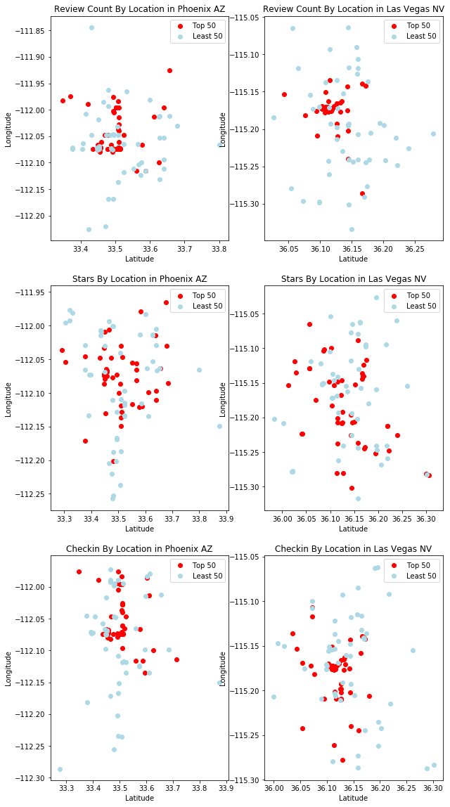


The graph above shows that restaurants of top 50 review count and checkin are usually located on some specific locations. Even so, there are restaurants of least 50 on the same locations. It may be due to other factors, like customer service or food.

### Linear Model

**Phoenix, AZ**


```python
sql='''
    SELECT latitude,longitude,review_count
    FROM restaurants
    WHERE state = 'AZ' and city = 'Phoenix'
    ORDER BY review_count DESC;
    '''
```


```python
reviewcount_AZ = pd.read_sql(sql,mydb)
```


```python
reviewcount_AZ.head()
```


<div>
<style>
    .dataframe thead tr:only-child th {
        text-align: right;
    }

    .dataframe thead th {
        text-align: left;
    }

    .dataframe tbody tr th {
        vertical-align: top;
    }
</style>
<table border="1" class="dataframe">
  <thead>
    <tr style="text-align: right;">
      <th></th>
      <th>latitude</th>
      <th>longitude</th>
      <th>review_count</th>
    </tr>
  </thead>
  <tbody>
    <tr>
      <th>0</th>
      <td>33.4492</td>
      <td>-112.066</td>
      <td>1899</td>
    </tr>
    <tr>
      <th>1</th>
      <td>33.5611</td>
      <td>-112.116</td>
      <td>1691</td>
    </tr>
    <tr>
      <th>2</th>
      <td>33.5006</td>
      <td>-112.074</td>
      <td>1671</td>
    </tr>
    <tr>
      <th>3</th>
      <td>33.4550</td>
      <td>-112.080</td>
      <td>1602</td>
    </tr>
    <tr>
      <th>4</th>
      <td>33.4692</td>
      <td>-112.047</td>
      <td>1534</td>
    </tr>
  </tbody>
</table>
</div>


```python
reviewcount_AZ_y=reviewcount_AZ['review_count']
```


```python
reviewcount_AZ_x = reviewcount_AZ
```


```python
del reviewcount_AZ_x['review_count']
```


```python
import pandas as pd
import numpy as np
from sklearn import datasets, linear_model
from sklearn.linear_model import LinearRegression
import statsmodels.api as sm
from scipy import stats
```


```python
# Model and check its results.
X2 = sm.add_constant(reviewcount_AZ_x)
est = sm.OLS(reviewcount_AZ_y, X2)
est2 = est.fit()
print(est2.summary())
```

    D:\Anaconda\lib\site-packages\statsmodels\compat\pandas.py:56: FutureWarning: The pandas.core.datetools module is deprecated and will be removed in a future version. Please use the pandas.tseries module instead.
      from pandas.core import datetools
    

                                OLS Regression Results                            
    ==============================================================================
    Dep. Variable:           review_count   R-squared:                       0.013
    Model:                            OLS   Adj. R-squared:                  0.013
    Method:                 Least Squares   F-statistic:                     23.97
    Date:                Fri, 08 Dec 2017   Prob (F-statistic):           4.56e-11
    Time:                        09:50:10   Log-Likelihood:                -22690.
    No. Observations:                3515   AIC:                         4.539e+04
    Df Residuals:                    3512   BIC:                         4.540e+04
    Df Model:                           2                                         
    Covariance Type:            nonrobust                                         
    ==============================================================================
                     coef    std err          t      P>|t|      [0.025      0.975]
    ------------------------------------------------------------------------------
    const       3.087e+04   4446.730      6.941      0.000    2.21e+04    3.96e+04
    latitude     -30.3090     26.279     -1.153      0.249     -81.833      21.215
    longitude    265.6006     39.357      6.749      0.000     188.436     342.765
    ==============================================================================
    Omnibus:                     3362.217   Durbin-Watson:                   0.027
    Prob(Omnibus):                  0.000   Jarque-Bera (JB):           155429.904
    Skew:                           4.624   Prob(JB):                         0.00
    Kurtosis:                      34.237   Cond. No.                     2.00e+05
    ==============================================================================
    
    Warnings:
    [1] Standard Errors assume that the covariance matrix of the errors is correctly specified.
    [2] The condition number is large,  2e+05. This might indicate that there are
    strong multicollinearity or other numerical problems.
    


```python
sql='''
    SELECT latitude,longitude,stars
    FROM restaurants
    WHERE state = 'AZ' and city = 'Phoenix'
    ORDER BY stars DESC;
    '''
```


```python
stars_AZ = pd.read_sql(sql,mydb)
```


```python
stars_AZ_y = stars_AZ['stars']
```


```python
stars_AZ_x = stars_AZ[['latitude','longitude']]
```


```python
X2 = sm.add_constant(stars_AZ_x)
est = sm.OLS(stars_AZ_y, X2)
est2 = est.fit()
print(est2.summary())
```

                                OLS Regression Results                            
    ==============================================================================
    Dep. Variable:                  stars   R-squared:                       0.005
    Model:                            OLS   Adj. R-squared:                  0.004
    Method:                 Least Squares   F-statistic:                     7.946
    Date:                Fri, 08 Dec 2017   Prob (F-statistic):           0.000360
    Time:                        10:07:37   Log-Likelihood:                -4308.0
    No. Observations:                3515   AIC:                             8622.
    Df Residuals:                    3512   BIC:                             8640.
    Df Model:                           2                                         
    Covariance Type:            nonrobust                                         
    ==============================================================================
                     coef    std err          t      P>|t|      [0.025      0.975]
    ------------------------------------------------------------------------------
    const         98.3713     23.819      4.130      0.000      51.671     145.071
    latitude      -0.0669      0.141     -0.475      0.634      -0.343       0.209
    longitude      0.8271      0.211      3.924      0.000       0.414       1.240
    ==============================================================================
    Omnibus:                      127.585   Durbin-Watson:                   0.010
    Prob(Omnibus):                  0.000   Jarque-Bera (JB):              140.811
    Skew:                          -0.487   Prob(JB):                     2.65e-31
    Kurtosis:                       2.885   Cond. No.                     2.00e+05
    ==============================================================================
    
    Warnings:
    [1] Standard Errors assume that the covariance matrix of the errors is correctly specified.
    [2] The condition number is large,  2e+05. This might indicate that there are
    strong multicollinearity or other numerical problems.
    


```python
sql='''
    SELECT business_id, restaurants.latitude,restaurants.longitude,ROUND(AVG(checkin.count),2) AS checkin
    FROM checkin
    JOIN restaurants
    ON restaurants.id = checkin.business_id AND
    state = 'AZ' AND city = 'Phoenix'
    GROUP BY business_id,restaurants.latitude,restaurants.longitude
    ORDER BY ROUND(AVG(checkin.count),2) DESC;
    '''
```


```python
checkin_AZ = pd.read_sql(sql,mydb)
```


```python
checkin_AZ_y = checkin_AZ['checkin']
```


```python
checkin_AZ_x = checkin_AZ[['latitude','longitude']]
```


```python
X2 = sm.add_constant(checkin_AZ_x)
est = sm.OLS(checkin_AZ_y, X2)
est2 = est.fit()
print(est2.summary())
```

                                OLS Regression Results                            
    ==============================================================================
    Dep. Variable:                checkin   R-squared:                       0.017
    Model:                            OLS   Adj. R-squared:                  0.016
    Method:                 Least Squares   F-statistic:                     29.26
    Date:                Fri, 08 Dec 2017   Prob (F-statistic):           2.51e-13
    Time:                        10:17:38   Log-Likelihood:                -10649.
    No. Observations:                3389   AIC:                         2.130e+04
    Df Residuals:                    3386   BIC:                         2.132e+04
    Df Model:                           2                                         
    Covariance Type:            nonrobust                                         
    ==============================================================================
                     coef    std err          t      P>|t|      [0.025      0.975]
    ------------------------------------------------------------------------------
    const       1266.1368    165.001      7.674      0.000     942.626    1589.648
    latitude      -1.1212      0.972     -1.153      0.249      -3.027       0.785
    longitude     10.9279      1.460      7.487      0.000       8.066      13.790
    ==============================================================================
    Omnibus:                     3062.798   Durbin-Watson:                   0.035
    Prob(Omnibus):                  0.000   Jarque-Bera (JB):           109071.324
    Skew:                           4.315   Prob(JB):                         0.00
    Kurtosis:                      29.418   Cond. No.                     2.00e+05
    ==============================================================================
    
    Warnings:
    [1] Standard Errors assume that the covariance matrix of the errors is correctly specified.
    [2] The condition number is large,  2e+05. This might indicate that there are
    strong multicollinearity or other numerical problems.
    

** Las Vegas, NV **


```python
sql='''
    SELECT latitude,longitude,review_count
    FROM restaurants
    WHERE state = 'NV' AND city = 'Las Vegas'
    ORDER BY review_count DESC;
    '''
```


```python
reviewcount_NV = pd.read_sql(sql,mydb)
```


```python
reviewcount_NV.head()
```


<div>
<style>
    .dataframe thead tr:only-child th {
        text-align: right;
    }

    .dataframe thead th {
        text-align: left;
    }

    .dataframe tbody tr th {
        vertical-align: top;
    }
</style>
<table border="1" class="dataframe">
  <thead>
    <tr style="text-align: right;">
      <th></th>
      <th>latitude</th>
      <th>longitude</th>
      <th>review_count</th>
    </tr>
  </thead>
  <tbody>
    <tr>
      <th>0</th>
      <td>36.1128</td>
      <td>-115.173</td>
      <td>6979</td>
    </tr>
    <tr>
      <th>1</th>
      <td>36.1161</td>
      <td>-115.176</td>
      <td>6417</td>
    </tr>
    <tr>
      <th>2</th>
      <td>36.1094</td>
      <td>-115.176</td>
      <td>5632</td>
    </tr>
    <tr>
      <th>3</th>
      <td>36.1107</td>
      <td>-115.172</td>
      <td>5429</td>
    </tr>
    <tr>
      <th>4</th>
      <td>36.1094</td>
      <td>-115.172</td>
      <td>4789</td>
    </tr>
  </tbody>
</table>
</div>


```python
reviewcount_NV_y=reviewcount_NV['review_count']
```


```python
reviewcount_NV_x = reviewcount_NV
```


```python
del reviewcount_NV_x['review_count']
```


```python
X2 = sm.add_constant(reviewcount_NV_x)
est = sm.OLS(reviewcount_NV_y, X2)
est2 = est.fit()
print(est2.summary())
```

                                OLS Regression Results                            
    ==============================================================================
    Dep. Variable:           review_count   R-squared:                       0.005
    Model:                            OLS   Adj. R-squared:                  0.005
    Method:                 Least Squares   F-statistic:                     14.33
    Date:                Fri, 08 Dec 2017   Prob (F-statistic):           6.17e-07
    Time:                        10:11:16   Log-Likelihood:                -41219.
    No. Observations:                5685   AIC:                         8.244e+04
    Df Residuals:                    5682   BIC:                         8.246e+04
    Df Model:                           2                                         
    Covariance Type:            nonrobust                                         
    ==============================================================================
                     coef    std err          t      P>|t|      [0.025      0.975]
    ------------------------------------------------------------------------------
    const       3545.7382   7842.234      0.452      0.651   -1.18e+04    1.89e+04
    latitude    -429.7033     80.493     -5.338      0.000    -587.500    -271.906
    longitude   -105.2927     68.788     -1.531      0.126    -240.144      29.558
    ==============================================================================
    Omnibus:                     7905.064   Durbin-Watson:                   0.013
    Prob(Omnibus):                  0.000   Jarque-Bera (JB):          2556148.968
    Skew:                           8.043   Prob(JB):                         0.00
    Kurtosis:                     105.627   Cond. No.                     2.09e+05
    ==============================================================================
    
    Warnings:
    [1] Standard Errors assume that the covariance matrix of the errors is correctly specified.
    [2] The condition number is large, 2.09e+05. This might indicate that there are
    strong multicollinearity or other numerical problems.
    


```python
sql='''
    SELECT latitude,longitude,stars
    FROM restaurants
    WHERE state = 'NV' AND city = 'Las Vegas'
    ORDER BY stars DESC;
    '''
```


```python
stars_NV = pd.read_sql(sql,mydb)
```


```python
stars_NV_y = stars_NV['stars']
```


```python
stars_NV_x = stars_NV[['latitude','longitude']]
```


```python
X2 = sm.add_constant(stars_AZ_x)
est = sm.OLS(stars_AZ_y, X2)
est2 = est.fit()
print(est2.summary())
```

                                OLS Regression Results                            
    ==============================================================================
    Dep. Variable:                  stars   R-squared:                       0.005
    Model:                            OLS   Adj. R-squared:                  0.004
    Method:                 Least Squares   F-statistic:                     7.946
    Date:                Fri, 08 Dec 2017   Prob (F-statistic):           0.000360
    Time:                        10:11:29   Log-Likelihood:                -4308.0
    No. Observations:                3515   AIC:                             8622.
    Df Residuals:                    3512   BIC:                             8640.
    Df Model:                           2                                         
    Covariance Type:            nonrobust                                         
    ==============================================================================
                     coef    std err          t      P>|t|      [0.025      0.975]
    ------------------------------------------------------------------------------
    const         98.3713     23.819      4.130      0.000      51.671     145.071
    latitude      -0.0669      0.141     -0.475      0.634      -0.343       0.209
    longitude      0.8271      0.211      3.924      0.000       0.414       1.240
    ==============================================================================
    Omnibus:                      127.585   Durbin-Watson:                   0.010
    Prob(Omnibus):                  0.000   Jarque-Bera (JB):              140.811
    Skew:                          -0.487   Prob(JB):                     2.65e-31
    Kurtosis:                       2.885   Cond. No.                     2.00e+05
    ==============================================================================
    
    Warnings:
    [1] Standard Errors assume that the covariance matrix of the errors is correctly specified.
    [2] The condition number is large,  2e+05. This might indicate that there are
    strong multicollinearity or other numerical problems.
    


```python
sql='''
    SELECT business_id, restaurants.latitude,restaurants.longitude,ROUND(AVG(checkin.count),2) AS checkin
    FROM checkin
    JOIN restaurants
    ON restaurants.id = checkin.business_id AND
    state = 'NV' AND city = 'Las Vegas'
    GROUP BY business_id,restaurants.latitude,restaurants.longitude
    ORDER BY ROUND(AVG(checkin.count),2) DESC;
    '''
```


```python
checkin_NV = pd.read_sql(sql,mydb)
```


```python
checkin_NV_y = checkin_NV['checkin']
```


```python
checkin_NV_x = checkin_NV[['latitude','longitude']]
```


```python
X2 = sm.add_constant(checkin_NV_x)
est = sm.OLS(checkin_NV_y, X2)
est2 = est.fit()
print(est2.summary())
```

                                OLS Regression Results                            
    ==============================================================================
    Dep. Variable:                checkin   R-squared:                       0.011
    Model:                            OLS   Adj. R-squared:                  0.011
    Method:                 Least Squares   F-statistic:                     30.49
    Date:                Fri, 08 Dec 2017   Prob (F-statistic):           6.74e-14
    Time:                        10:11:37   Log-Likelihood:                -20411.
    No. Observations:                5535   AIC:                         4.083e+04
    Df Residuals:                    5532   BIC:                         4.085e+04
    Df Model:                           2                                         
    Covariance Type:            nonrobust                                         
    ==============================================================================
                     coef    std err          t      P>|t|      [0.025      0.975]
    ------------------------------------------------------------------------------
    const       -492.0634    226.458     -2.173      0.030    -936.009     -48.117
    latitude     -16.4082      2.320     -7.071      0.000     -20.957     -11.859
    longitude     -9.4641      1.989     -4.757      0.000     -13.364      -5.564
    ==============================================================================
    Omnibus:                     7314.253   Durbin-Watson:                   0.027
    Prob(Omnibus):                  0.000   Jarque-Bera (JB):          1932503.930
    Skew:                           7.348   Prob(JB):                         0.00
    Kurtosis:                      93.352   Cond. No.                     2.10e+05
    ==============================================================================
    
    Warnings:
    [1] Standard Errors assume that the covariance matrix of the errors is correctly specified.
    [2] The condition number is large, 2.1e+05. This might indicate that there are
    strong multicollinearity or other numerical problems.
    

The results of linear models above shows that in Phoenix, review count and check-in count are more related to location. In both cities, stars are rarely related to location 

### Webscrapping, load data of population density

We know that location is usually related to population density. For example, some shopping malls usually located on downtwon, which attracts citizens. Therefore, we will use webscrapping to load data of population density.

** Phoenix, AZ **


```python
import urllib.request
from bs4 import BeautifulSoup as bs

url = "http://zipatlas.com/us/az/phoenix/zip-code-comparison/population-density.htm"
request = urllib.request.Request(url)
response = urllib.request.urlopen(request)
data = response.read()
response.close()

# Create the soup
soup = bs(data, "html.parser")

# ---- Now we start parsing the table

bigtables = soup.findAll('div')

myLists = []

for bigtable in bigtables:
    tables = bigtable.findAll('table')
    for table in tables:
        rows = table.findAll('tr')
        r = []
        for row in rows:
            cells = row.findAll('td')
            c = []        
            for cell in cells:
                c.append(cell.getText())
            r.append(c)
        myLists.append(r)

print (myLists)
```

    [[['Phoenix, AZ Report:', '\n\r\n\t\t\t\t\t\t\tPopulation Density\r\n\t\t\t\t\t\t\n']], [['\n\n\n\n\r\n\t\t\t\t\t\t\tshowCity();\r\n\t\t\t\t\t\t\n', '\n\n\n8,875.90\n\n\n\n\n\n\n\n34.26\n\n\n', '8,875.90', '\n\n', '34.26'], ['8,875.90'], ['\n\n'], ['34.26']], [['8,875.90'], ['\n\n'], ['34.26']], [['Related ReportsPopulation Density in Arizona by Zip CodePopulation Density in Arizona by CityPopulation Density in the United States by Zip CodePopulation Density in the United States by City#Zip CodeLocationCityPopulationPeople / Sq. MileNational Rank1.8503333.492969, -112.209757Phoenix, Arizona53,7488,875.90#6972.8501533.508664, -112.102018Phoenix, Arizona42,6968,661.01#7293.8500633.465234, -112.048771Phoenix, Arizona31,6168,085.04#8144.8501733.508782, -112.123068Phoenix, Arizona40,3857,602.47#8985.8503533.471384, -112.195259Phoenix, Arizona44,6647,551.90#9116.8501933.511534, -112.143319Phoenix, Arizona25,5877,061.64#1,0167.8503133.496009, -112.167195Phoenix, Arizona28,7316,988.32#1,0378.8501433.508316, -112.057351Phoenix, Arizona28,5166,821.43#1,0839.8505133.559465, -112.133059Phoenix, Arizona41,3076,497.80#1,17210.8505333.629939, -112.131344Phoenix, Arizona28,4605,966.09#1,32511.8502133.559430, -112.094935Phoenix, Arizona37,9985,661.64#1,43212.8501333.511087, -112.084749Phoenix, Arizona20,8425,621.04#1,45513.8503233.625920, -112.002503Phoenix, Arizona69,1895,492.96#1,50314.8500833.462954, -111.985178Phoenix, Arizona56,3795,472.26#1,51215.8502233.624006, -112.050013Phoenix, Arizona44,6735,032.52#1,69916.8500333.450460, -112.078284Phoenix, Arizona9,2524,849.46#1,80017.8501633.507780, -112.032731Phoenix, Arizona36,4174,543.09#1,99418.8502933.595414, -112.109750Phoenix, Arizona46,2484,421.25#2,06219.8502333.635109, -112.093768Phoenix, Arizona33,3144,258.43#2,16720.8503733.490164, -112.268027Phoenix, Arizona33,1504,091.51#2,27421.8501833.500568, -111.980599Phoenix, Arizona38,7863,754.93#2,52122.8502033.568669, -112.050446Phoenix, Arizona34,7213,624.64#2,63323.8500933.443097, -112.128136Phoenix, Arizona56,0343,586.50#2,67324.8500733.447614, -112.090883Phoenix, Arizona15,9863,518.51#2,73225.8504033.389633, -112.027932Phoenix, Arizona62,9483,322.89#2,89026.8502833.582359, -112.004940Phoenix, Arizona20,5653,260.51#2,96227.8504833.303055, -112.034014Phoenix, Arizona33,4313,207.89#3,01528.8501233.505386, -112.071066Phoenix, Arizona6,2762,937.96#3,27729.8505033.704782, -111.990423Phoenix, Arizona19,1772,344.59#3,97130.8500433.451532, -112.069837Phoenix, Arizona4,6082,261.64#4,07531.8504133.372939, -112.110643Phoenix, Arizona32,2971,582.48#5,10532.8504533.299769, -112.123507Phoenix, Arizona4,5581,374.17#5,48933.8504433.339569, -112.040475Phoenix, Arizona39,8921,346.32#5,53734.8502433.683927, -112.025062Phoenix, Arizona19,3241,162.11#5,95535.8503433.429462, -112.013854Phoenix, Arizona8,665745.96#7,08436.8502733.756748, -112.133525Phoenix, Arizona38,569561.87#7,83237.8504333.430383, -112.202919Phoenix, Arizona10,820477.97#8,29238.8505433.683928, -111.949697Phoenix, Arizona2,032242.78#10,40539.8508633.846754, -112.085914Phoenix, Arizona8,655172.80#11,65540.8508533.773409, -112.074522Phoenix, Arizona57734.26#20,676', '#', 'Zip Code', 'Location', 'City', 'Population', 'People / Sq. Mile', 'National Rank', '1.', '85033', '33.492969, -112.209757', 'Phoenix, Arizona', '53,748', '8,875.90', '#697', '2.', '85015', '33.508664, -112.102018', 'Phoenix, Arizona', '42,696', '8,661.01', '#729', '3.', '85006', '33.465234, -112.048771', 'Phoenix, Arizona', '31,616', '8,085.04', '#814', '4.', '85017', '33.508782, -112.123068', 'Phoenix, Arizona', '40,385', '7,602.47', '#898', '5.', '85035', '33.471384, -112.195259', 'Phoenix, Arizona', '44,664', '7,551.90', '#911', '6.', '85019', '33.511534, -112.143319', 'Phoenix, Arizona', '25,587', '7,061.64', '#1,016', '7.', '85031', '33.496009, -112.167195', 'Phoenix, Arizona', '28,731', '6,988.32', '#1,037', '8.', '85014', '33.508316, -112.057351', 'Phoenix, Arizona', '28,516', '6,821.43', '#1,083', '9.', '85051', '33.559465, -112.133059', 'Phoenix, Arizona', '41,307', '6,497.80', '#1,172', '10.', '85053', '33.629939, -112.131344', 'Phoenix, Arizona', '28,460', '5,966.09', '#1,325', '11.', '85021', '33.559430, -112.094935', 'Phoenix, Arizona', '37,998', '5,661.64', '#1,432', '12.', '85013', '33.511087, -112.084749', 'Phoenix, Arizona', '20,842', '5,621.04', '#1,455', '13.', '85032', '33.625920, -112.002503', 'Phoenix, Arizona', '69,189', '5,492.96', '#1,503', '14.', '85008', '33.462954, -111.985178', 'Phoenix, Arizona', '56,379', '5,472.26', '#1,512', '15.', '85022', '33.624006, -112.050013', 'Phoenix, Arizona', '44,673', '5,032.52', '#1,699', '16.', '85003', '33.450460, -112.078284', 'Phoenix, Arizona', '9,252', '4,849.46', '#1,800', '17.', '85016', '33.507780, -112.032731', 'Phoenix, Arizona', '36,417', '4,543.09', '#1,994', '18.', '85029', '33.595414, -112.109750', 'Phoenix, Arizona', '46,248', '4,421.25', '#2,062', '19.', '85023', '33.635109, -112.093768', 'Phoenix, Arizona', '33,314', '4,258.43', '#2,167', '20.', '85037', '33.490164, -112.268027', 'Phoenix, Arizona', '33,150', '4,091.51', '#2,274', '21.', '85018', '33.500568, -111.980599', 'Phoenix, Arizona', '38,786', '3,754.93', '#2,521', '22.', '85020', '33.568669, -112.050446', 'Phoenix, Arizona', '34,721', '3,624.64', '#2,633', '23.', '85009', '33.443097, -112.128136', 'Phoenix, Arizona', '56,034', '3,586.50', '#2,673', '24.', '85007', '33.447614, -112.090883', 'Phoenix, Arizona', '15,986', '3,518.51', '#2,732', '25.', '85040', '33.389633, -112.027932', 'Phoenix, Arizona', '62,948', '3,322.89', '#2,890', '26.', '85028', '33.582359, -112.004940', 'Phoenix, Arizona', '20,565', '3,260.51', '#2,962', '27.', '85048', '33.303055, -112.034014', 'Phoenix, Arizona', '33,431', '3,207.89', '#3,015', '28.', '85012', '33.505386, -112.071066', 'Phoenix, Arizona', '6,276', '2,937.96', '#3,277', '29.', '85050', '33.704782, -111.990423', 'Phoenix, Arizona', '19,177', '2,344.59', '#3,971', '30.', '85004', '33.451532, -112.069837', 'Phoenix, Arizona', '4,608', '2,261.64', '#4,075', '31.', '85041', '33.372939, -112.110643', 'Phoenix, Arizona', '32,297', '1,582.48', '#5,105', '32.', '85045', '33.299769, -112.123507', 'Phoenix, Arizona', '4,558', '1,374.17', '#5,489', '33.', '85044', '33.339569, -112.040475', 'Phoenix, Arizona', '39,892', '1,346.32', '#5,537', '34.', '85024', '33.683927, -112.025062', 'Phoenix, Arizona', '19,324', '1,162.11', '#5,955', '35.', '85034', '33.429462, -112.013854', 'Phoenix, Arizona', '8,665', '745.96', '#7,084', '36.', '85027', '33.756748, -112.133525', 'Phoenix, Arizona', '38,569', '561.87', '#7,832', '37.', '85043', '33.430383, -112.202919', 'Phoenix, Arizona', '10,820', '477.97', '#8,292', '38.', '85054', '33.683928, -111.949697', 'Phoenix, Arizona', '2,032', '242.78', '#10,405', '39.', '85086', '33.846754, -112.085914', 'Phoenix, Arizona', '8,655', '172.80', '#11,655', '40.', '85085', '33.773409, -112.074522', 'Phoenix, Arizona', '577', '34.26', '#20,676'], ['#', 'Zip Code', 'Location', 'City', 'Population', 'People / Sq. Mile', 'National Rank'], ['1.', '85033', '33.492969, -112.209757', 'Phoenix, Arizona', '53,748', '8,875.90', '#697'], ['2.', '85015', '33.508664, -112.102018', 'Phoenix, Arizona', '42,696', '8,661.01', '#729'], ['3.', '85006', '33.465234, -112.048771', 'Phoenix, Arizona', '31,616', '8,085.04', '#814'], ['4.', '85017', '33.508782, -112.123068', 'Phoenix, Arizona', '40,385', '7,602.47', '#898'], ['5.', '85035', '33.471384, -112.195259', 'Phoenix, Arizona', '44,664', '7,551.90', '#911'], ['6.', '85019', '33.511534, -112.143319', 'Phoenix, Arizona', '25,587', '7,061.64', '#1,016'], ['7.', '85031', '33.496009, -112.167195', 'Phoenix, Arizona', '28,731', '6,988.32', '#1,037'], ['8.', '85014', '33.508316, -112.057351', 'Phoenix, Arizona', '28,516', '6,821.43', '#1,083'], ['9.', '85051', '33.559465, -112.133059', 'Phoenix, Arizona', '41,307', '6,497.80', '#1,172'], ['10.', '85053', '33.629939, -112.131344', 'Phoenix, Arizona', '28,460', '5,966.09', '#1,325'], ['11.', '85021', '33.559430, -112.094935', 'Phoenix, Arizona', '37,998', '5,661.64', '#1,432'], ['12.', '85013', '33.511087, -112.084749', 'Phoenix, Arizona', '20,842', '5,621.04', '#1,455'], ['13.', '85032', '33.625920, -112.002503', 'Phoenix, Arizona', '69,189', '5,492.96', '#1,503'], ['14.', '85008', '33.462954, -111.985178', 'Phoenix, Arizona', '56,379', '5,472.26', '#1,512'], ['15.', '85022', '33.624006, -112.050013', 'Phoenix, Arizona', '44,673', '5,032.52', '#1,699'], ['16.', '85003', '33.450460, -112.078284', 'Phoenix, Arizona', '9,252', '4,849.46', '#1,800'], ['17.', '85016', '33.507780, -112.032731', 'Phoenix, Arizona', '36,417', '4,543.09', '#1,994'], ['18.', '85029', '33.595414, -112.109750', 'Phoenix, Arizona', '46,248', '4,421.25', '#2,062'], ['19.', '85023', '33.635109, -112.093768', 'Phoenix, Arizona', '33,314', '4,258.43', '#2,167'], ['20.', '85037', '33.490164, -112.268027', 'Phoenix, Arizona', '33,150', '4,091.51', '#2,274'], ['21.', '85018', '33.500568, -111.980599', 'Phoenix, Arizona', '38,786', '3,754.93', '#2,521'], ['22.', '85020', '33.568669, -112.050446', 'Phoenix, Arizona', '34,721', '3,624.64', '#2,633'], ['23.', '85009', '33.443097, -112.128136', 'Phoenix, Arizona', '56,034', '3,586.50', '#2,673'], ['24.', '85007', '33.447614, -112.090883', 'Phoenix, Arizona', '15,986', '3,518.51', '#2,732'], ['25.', '85040', '33.389633, -112.027932', 'Phoenix, Arizona', '62,948', '3,322.89', '#2,890'], ['26.', '85028', '33.582359, -112.004940', 'Phoenix, Arizona', '20,565', '3,260.51', '#2,962'], ['27.', '85048', '33.303055, -112.034014', 'Phoenix, Arizona', '33,431', '3,207.89', '#3,015'], ['28.', '85012', '33.505386, -112.071066', 'Phoenix, Arizona', '6,276', '2,937.96', '#3,277'], ['29.', '85050', '33.704782, -111.990423', 'Phoenix, Arizona', '19,177', '2,344.59', '#3,971'], ['30.', '85004', '33.451532, -112.069837', 'Phoenix, Arizona', '4,608', '2,261.64', '#4,075'], ['31.', '85041', '33.372939, -112.110643', 'Phoenix, Arizona', '32,297', '1,582.48', '#5,105'], ['32.', '85045', '33.299769, -112.123507', 'Phoenix, Arizona', '4,558', '1,374.17', '#5,489'], ['33.', '85044', '33.339569, -112.040475', 'Phoenix, Arizona', '39,892', '1,346.32', '#5,537'], ['34.', '85024', '33.683927, -112.025062', 'Phoenix, Arizona', '19,324', '1,162.11', '#5,955'], ['35.', '85034', '33.429462, -112.013854', 'Phoenix, Arizona', '8,665', '745.96', '#7,084'], ['36.', '85027', '33.756748, -112.133525', 'Phoenix, Arizona', '38,569', '561.87', '#7,832'], ['37.', '85043', '33.430383, -112.202919', 'Phoenix, Arizona', '10,820', '477.97', '#8,292'], ['38.', '85054', '33.683928, -111.949697', 'Phoenix, Arizona', '2,032', '242.78', '#10,405'], ['39.', '85086', '33.846754, -112.085914', 'Phoenix, Arizona', '8,655', '172.80', '#11,655'], ['40.', '85085', '33.773409, -112.074522', 'Phoenix, Arizona', '577', '34.26', '#20,676'], ['1-40 out of 40 total\xa0\xa0\xa0[\xa0\xa01\xa0\xa0]', '1-40 out of 40 total', '\xa0\xa0\xa0', '[\xa0\xa01\xa0\xa0]'], ['1-40 out of 40 total', '\xa0\xa0\xa0', '[\xa0\xa01\xa0\xa0]']], [['#', 'Zip Code', 'Location', 'City', 'Population', 'People / Sq. Mile', 'National Rank'], ['1.', '85033', '33.492969, -112.209757', 'Phoenix, Arizona', '53,748', '8,875.90', '#697'], ['2.', '85015', '33.508664, -112.102018', 'Phoenix, Arizona', '42,696', '8,661.01', '#729'], ['3.', '85006', '33.465234, -112.048771', 'Phoenix, Arizona', '31,616', '8,085.04', '#814'], ['4.', '85017', '33.508782, -112.123068', 'Phoenix, Arizona', '40,385', '7,602.47', '#898'], ['5.', '85035', '33.471384, -112.195259', 'Phoenix, Arizona', '44,664', '7,551.90', '#911'], ['6.', '85019', '33.511534, -112.143319', 'Phoenix, Arizona', '25,587', '7,061.64', '#1,016'], ['7.', '85031', '33.496009, -112.167195', 'Phoenix, Arizona', '28,731', '6,988.32', '#1,037'], ['8.', '85014', '33.508316, -112.057351', 'Phoenix, Arizona', '28,516', '6,821.43', '#1,083'], ['9.', '85051', '33.559465, -112.133059', 'Phoenix, Arizona', '41,307', '6,497.80', '#1,172'], ['10.', '85053', '33.629939, -112.131344', 'Phoenix, Arizona', '28,460', '5,966.09', '#1,325'], ['11.', '85021', '33.559430, -112.094935', 'Phoenix, Arizona', '37,998', '5,661.64', '#1,432'], ['12.', '85013', '33.511087, -112.084749', 'Phoenix, Arizona', '20,842', '5,621.04', '#1,455'], ['13.', '85032', '33.625920, -112.002503', 'Phoenix, Arizona', '69,189', '5,492.96', '#1,503'], ['14.', '85008', '33.462954, -111.985178', 'Phoenix, Arizona', '56,379', '5,472.26', '#1,512'], ['15.', '85022', '33.624006, -112.050013', 'Phoenix, Arizona', '44,673', '5,032.52', '#1,699'], ['16.', '85003', '33.450460, -112.078284', 'Phoenix, Arizona', '9,252', '4,849.46', '#1,800'], ['17.', '85016', '33.507780, -112.032731', 'Phoenix, Arizona', '36,417', '4,543.09', '#1,994'], ['18.', '85029', '33.595414, -112.109750', 'Phoenix, Arizona', '46,248', '4,421.25', '#2,062'], ['19.', '85023', '33.635109, -112.093768', 'Phoenix, Arizona', '33,314', '4,258.43', '#2,167'], ['20.', '85037', '33.490164, -112.268027', 'Phoenix, Arizona', '33,150', '4,091.51', '#2,274'], ['21.', '85018', '33.500568, -111.980599', 'Phoenix, Arizona', '38,786', '3,754.93', '#2,521'], ['22.', '85020', '33.568669, -112.050446', 'Phoenix, Arizona', '34,721', '3,624.64', '#2,633'], ['23.', '85009', '33.443097, -112.128136', 'Phoenix, Arizona', '56,034', '3,586.50', '#2,673'], ['24.', '85007', '33.447614, -112.090883', 'Phoenix, Arizona', '15,986', '3,518.51', '#2,732'], ['25.', '85040', '33.389633, -112.027932', 'Phoenix, Arizona', '62,948', '3,322.89', '#2,890'], ['26.', '85028', '33.582359, -112.004940', 'Phoenix, Arizona', '20,565', '3,260.51', '#2,962'], ['27.', '85048', '33.303055, -112.034014', 'Phoenix, Arizona', '33,431', '3,207.89', '#3,015'], ['28.', '85012', '33.505386, -112.071066', 'Phoenix, Arizona', '6,276', '2,937.96', '#3,277'], ['29.', '85050', '33.704782, -111.990423', 'Phoenix, Arizona', '19,177', '2,344.59', '#3,971'], ['30.', '85004', '33.451532, -112.069837', 'Phoenix, Arizona', '4,608', '2,261.64', '#4,075'], ['31.', '85041', '33.372939, -112.110643', 'Phoenix, Arizona', '32,297', '1,582.48', '#5,105'], ['32.', '85045', '33.299769, -112.123507', 'Phoenix, Arizona', '4,558', '1,374.17', '#5,489'], ['33.', '85044', '33.339569, -112.040475', 'Phoenix, Arizona', '39,892', '1,346.32', '#5,537'], ['34.', '85024', '33.683927, -112.025062', 'Phoenix, Arizona', '19,324', '1,162.11', '#5,955'], ['35.', '85034', '33.429462, -112.013854', 'Phoenix, Arizona', '8,665', '745.96', '#7,084'], ['36.', '85027', '33.756748, -112.133525', 'Phoenix, Arizona', '38,569', '561.87', '#7,832'], ['37.', '85043', '33.430383, -112.202919', 'Phoenix, Arizona', '10,820', '477.97', '#8,292'], ['38.', '85054', '33.683928, -111.949697', 'Phoenix, Arizona', '2,032', '242.78', '#10,405'], ['39.', '85086', '33.846754, -112.085914', 'Phoenix, Arizona', '8,655', '172.80', '#11,655'], ['40.', '85085', '33.773409, -112.074522', 'Phoenix, Arizona', '577', '34.26', '#20,676']], [['1-40 out of 40 total', '\xa0\xa0\xa0', '[\xa0\xa01\xa0\xa0]']], [['\xa0% Apart./Condos\xa0% Arabs\xa0% Asians\xa0% Blacks\xa0% Bottled Gas\xa0% Carpool to Work\xa0% Children Under 10\xa0% Chinese\xa0% Coal / Coke\xa0% College Grad.\xa0% Construction Jobs\xa0% Cubans\xa0% Czechs\xa0% Danish\xa0% Detached\xa0% Drive to Work\xa0% Dutch\xa0% Electrical\xa0% English\xa0% Farming Jobs\xa0% Filipinos\xa0% French\xa0% French Canadians\xa0% Fuel/Oil\xa0% Germans\xa0% Gov. Employees', '\xa0% Greeks\xa0% H/Income < $10k\xa0% H/Income > $100k\xa0% H/holds 1+ Car\xa0% H/holds 2+ Cars\xa0% High School Grad.\xa0% Hispanics\xa0% Hungarians\xa0% In Agricultural\xa0% In Arts\xa0% In College\xa0% In Construction\xa0% In Finance\xa0% In High School\xa0% In IT\xa0% In Labor Force\xa0% In Labor Force (f)\xa0% In Labor Force (m)\xa0% In Manufacturing\xa0% In Military\xa0% In Retail Trade\xa0% In Science\xa0% In Social Work\xa0% In Transportation\xa0% Income Over $200k\xa0% Indians (Asian)', '\xa0% Irish\xa0% Italians\xa0% Japanese\xa0% Korens\xa0% Lithuanians\xa0% Management Jobs\xa0% Mexicans\xa0% Natives\xa0% No-Mortgage Prop.\xa0% Norwegians\xa0% Not in Labor Force\xa0% Owner-Occupied\xa0% Poles\xa0% Portugese\xa0% Poverty Level\xa0% Poverty Level\xa0% Production Jobs\xa0% Properties < $200k\xa0% Properties < $500k\xa0% Properties > $1M\xa0% Properties > $500k\xa0% Pub/Transit\xa0% Russians\xa0% Sales Jobs\xa0% Scotts\xa0% Self-Employed', '\xa0% Seniors Over 65\xa0% Service Jobs\xa0% Slovaks\xa0% Solar Heated\xa0% Swedes\xa0% Swiss\xa0% Tenant-Occupied\xa0% Ukranians\xa0% Unemployment Rate\xa0% Utility Gas\xa0% Vacant Homes\xa0% Walk to Work\xa0% Welsh\xa0% West Indians\xa0% Whites\xa0% Wood Heated\xa0% Work from Home\xa0Avg. Income/H/hold\xa0Avg. Income/Person\xa0Avg. Population Age\xa0Commute Time\xa0Females / Male\xa0Males / Female\xa0People / Sq. Mile\xa0Rooms / Home']], [['\xa0% Apart./Condos\xa0% Arabs\xa0% Asians\xa0% Blacks\xa0% Bottled Gas\xa0% Carpool to Work\xa0% Children Under 10\xa0% Chinese\xa0% Coal / Coke\xa0% College Grad.\xa0% Construction Jobs\xa0% Cubans\xa0% Czechs\xa0% Danish\xa0% Detached\xa0% Drive to Work\xa0% Dutch\xa0% Electrical\xa0% English\xa0% Farming Jobs\xa0% Filipinos\xa0% French\xa0% French Canadians\xa0% Fuel/Oil\xa0% Germans\xa0% Gov. Employees', '\xa0% Greeks\xa0% H/Income < $10k\xa0% H/Income > $100k\xa0% H/holds 1+ Car\xa0% H/holds 2+ Cars\xa0% High School Grad.\xa0% Hispanics\xa0% Hungarians\xa0% In Agricultural\xa0% In Arts\xa0% In College\xa0% In Construction\xa0% In Finance\xa0% In High School\xa0% In IT\xa0% In Labor Force\xa0% In Labor Force (f)\xa0% In Labor Force (m)\xa0% In Manufacturing\xa0% In Military\xa0% In Retail Trade\xa0% In Science\xa0% In Social Work\xa0% In Transportation\xa0% Income Over $200k\xa0% Indians (Asian)', '\xa0% Irish\xa0% Italians\xa0% Japanese\xa0% Korens\xa0% Lithuanians\xa0% Management Jobs\xa0% Mexicans\xa0% Natives\xa0% No-Mortgage Prop.\xa0% Norwegians\xa0% Not in Labor Force\xa0% Owner-Occupied\xa0% Poles\xa0% Portugese\xa0% Poverty Level\xa0% Poverty Level\xa0% Production Jobs\xa0% Properties < $200k\xa0% Properties < $500k\xa0% Properties > $1M\xa0% Properties > $500k\xa0% Pub/Transit\xa0% Russians\xa0% Sales Jobs\xa0% Scotts\xa0% Self-Employed', '\xa0% Seniors Over 65\xa0% Service Jobs\xa0% Slovaks\xa0% Solar Heated\xa0% Swedes\xa0% Swiss\xa0% Tenant-Occupied\xa0% Ukranians\xa0% Unemployment Rate\xa0% Utility Gas\xa0% Vacant Homes\xa0% Walk to Work\xa0% Welsh\xa0% West Indians\xa0% Whites\xa0% Wood Heated\xa0% Work from Home\xa0Avg. Income/H/hold\xa0Avg. Income/Person\xa0Avg. Population Age\xa0Commute Time\xa0Females / Male\xa0Males / Female\xa0People / Sq. Mile\xa0Rooms / Home']]]
    


```python
myLists[4]
```


    [['#',
      'Zip Code',
      'Location',
      'City',
      'Population',
      'People / Sq. Mile',
      'National Rank'],
     ['1.',
      '85033',
      '33.492969, -112.209757',
      'Phoenix, Arizona',
      '53,748',
      '8,875.90',
      '#697'],
     ['2.',
      '85015',
      '33.508664, -112.102018',
      'Phoenix, Arizona',
      '42,696',
      '8,661.01',
      '#729'],
     ['3.',
      '85006',
      '33.465234, -112.048771',
      'Phoenix, Arizona',
      '31,616',
      '8,085.04',
      '#814'],
     ['4.',
      '85017',
      '33.508782, -112.123068',
      'Phoenix, Arizona',
      '40,385',
      '7,602.47',
      '#898'],
     ['5.',
      '85035',
      '33.471384, -112.195259',
      'Phoenix, Arizona',
      '44,664',
      '7,551.90',
      '#911'],
     ['6.',
      '85019',
      '33.511534, -112.143319',
      'Phoenix, Arizona',
      '25,587',
      '7,061.64',
      '#1,016'],
     ['7.',
      '85031',
      '33.496009, -112.167195',
      'Phoenix, Arizona',
      '28,731',
      '6,988.32',
      '#1,037'],
     ['8.',
      '85014',
      '33.508316, -112.057351',
      'Phoenix, Arizona',
      '28,516',
      '6,821.43',
      '#1,083'],
     ['9.',
      '85051',
      '33.559465, -112.133059',
      'Phoenix, Arizona',
      '41,307',
      '6,497.80',
      '#1,172'],
     ['10.',
      '85053',
      '33.629939, -112.131344',
      'Phoenix, Arizona',
      '28,460',
      '5,966.09',
      '#1,325'],
     ['11.',
      '85021',
      '33.559430, -112.094935',
      'Phoenix, Arizona',
      '37,998',
      '5,661.64',
      '#1,432'],
     ['12.',
      '85013',
      '33.511087, -112.084749',
      'Phoenix, Arizona',
      '20,842',
      '5,621.04',
      '#1,455'],
     ['13.',
      '85032',
      '33.625920, -112.002503',
      'Phoenix, Arizona',
      '69,189',
      '5,492.96',
      '#1,503'],
     ['14.',
      '85008',
      '33.462954, -111.985178',
      'Phoenix, Arizona',
      '56,379',
      '5,472.26',
      '#1,512'],
     ['15.',
      '85022',
      '33.624006, -112.050013',
      'Phoenix, Arizona',
      '44,673',
      '5,032.52',
      '#1,699'],
     ['16.',
      '85003',
      '33.450460, -112.078284',
      'Phoenix, Arizona',
      '9,252',
      '4,849.46',
      '#1,800'],
     ['17.',
      '85016',
      '33.507780, -112.032731',
      'Phoenix, Arizona',
      '36,417',
      '4,543.09',
      '#1,994'],
     ['18.',
      '85029',
      '33.595414, -112.109750',
      'Phoenix, Arizona',
      '46,248',
      '4,421.25',
      '#2,062'],
     ['19.',
      '85023',
      '33.635109, -112.093768',
      'Phoenix, Arizona',
      '33,314',
      '4,258.43',
      '#2,167'],
     ['20.',
      '85037',
      '33.490164, -112.268027',
      'Phoenix, Arizona',
      '33,150',
      '4,091.51',
      '#2,274'],
     ['21.',
      '85018',
      '33.500568, -111.980599',
      'Phoenix, Arizona',
      '38,786',
      '3,754.93',
      '#2,521'],
     ['22.',
      '85020',
      '33.568669, -112.050446',
      'Phoenix, Arizona',
      '34,721',
      '3,624.64',
      '#2,633'],
     ['23.',
      '85009',
      '33.443097, -112.128136',
      'Phoenix, Arizona',
      '56,034',
      '3,586.50',
      '#2,673'],
     ['24.',
      '85007',
      '33.447614, -112.090883',
      'Phoenix, Arizona',
      '15,986',
      '3,518.51',
      '#2,732'],
     ['25.',
      '85040',
      '33.389633, -112.027932',
      'Phoenix, Arizona',
      '62,948',
      '3,322.89',
      '#2,890'],
     ['26.',
      '85028',
      '33.582359, -112.004940',
      'Phoenix, Arizona',
      '20,565',
      '3,260.51',
      '#2,962'],
     ['27.',
      '85048',
      '33.303055, -112.034014',
      'Phoenix, Arizona',
      '33,431',
      '3,207.89',
      '#3,015'],
     ['28.',
      '85012',
      '33.505386, -112.071066',
      'Phoenix, Arizona',
      '6,276',
      '2,937.96',
      '#3,277'],
     ['29.',
      '85050',
      '33.704782, -111.990423',
      'Phoenix, Arizona',
      '19,177',
      '2,344.59',
      '#3,971'],
     ['30.',
      '85004',
      '33.451532, -112.069837',
      'Phoenix, Arizona',
      '4,608',
      '2,261.64',
      '#4,075'],
     ['31.',
      '85041',
      '33.372939, -112.110643',
      'Phoenix, Arizona',
      '32,297',
      '1,582.48',
      '#5,105'],
     ['32.',
      '85045',
      '33.299769, -112.123507',
      'Phoenix, Arizona',
      '4,558',
      '1,374.17',
      '#5,489'],
     ['33.',
      '85044',
      '33.339569, -112.040475',
      'Phoenix, Arizona',
      '39,892',
      '1,346.32',
      '#5,537'],
     ['34.',
      '85024',
      '33.683927, -112.025062',
      'Phoenix, Arizona',
      '19,324',
      '1,162.11',
      '#5,955'],
     ['35.',
      '85034',
      '33.429462, -112.013854',
      'Phoenix, Arizona',
      '8,665',
      '745.96',
      '#7,084'],
     ['36.',
      '85027',
      '33.756748, -112.133525',
      'Phoenix, Arizona',
      '38,569',
      '561.87',
      '#7,832'],
     ['37.',
      '85043',
      '33.430383, -112.202919',
      'Phoenix, Arizona',
      '10,820',
      '477.97',
      '#8,292'],
     ['38.',
      '85054',
      '33.683928, -111.949697',
      'Phoenix, Arizona',
      '2,032',
      '242.78',
      '#10,405'],
     ['39.',
      '85086',
      '33.846754, -112.085914',
      'Phoenix, Arizona',
      '8,655',
      '172.80',
      '#11,655'],
     ['40.',
      '85085',
      '33.773409, -112.074522',
      'Phoenix, Arizona',
      '577',
      '34.26',
      '#20,676']]


```python
num=[]
postalcode=[]
lat=[]
lon=[]
city = []
population=[]
density=[]
nationalrank=[]
```


```python
for i in np.arange(1,len(myLists[4])):
    for j in np.arange(len(myLists[4][i])):
        if j == 0:
            num.append(myLists[4][i][j])
        elif j == 1:
            postalcode.append(int(myLists[4][i][j]))
        elif j == 2:
            lat.append(float(myLists[4][i][j].split(",")[0]))
            lon.append(float(myLists[4][i][j].split(",")[1]))
        elif j == 3:
            city.append(myLists[4][i][j])
        elif j == 4:
            if len(myLists[4][i][j].split(",")) == 2:
                population.append(int(myLists[4][i][j].split(",")[0])*1000 + int(myLists[4][i][j].split(",")[1]))
            elif len(myLists[4][i][j].split(",")) == 1:
                population.append(int(myLists[4][i][j]))
        elif j == 5:
            if len(myLists[4][i][j].split(",")) == 2:
                density.append(float(myLists[4][i][j].split(",")[0])*1000 + float(myLists[4][i][j].split(",")[1]))
            elif len(myLists[4][i][j].split(",")) == 1:
                density.append(float(myLists[4][i][j]))
        elif j == 6:
            nationalrank.append(myLists[4][i][j])
```


```python
density_AZ = pd.DataFrame(postalcode)
```


```python
# Stack them as a new dataframe
density_AZ['latitude']=lat
density_AZ['longitude']=lon
density_AZ['city']='Phoenix'
density_AZ['state']='AZ'
density_AZ['population']=population
density_AZ['density']=density
```


```python
len(density_AZ)
```


    40


** Las Vegas, NV**


```python
url = "http://zipatlas.com/us/nv/las-vegas/zip-code-comparison/population-density.htm"
request = urllib.request.Request(url)
response = urllib.request.urlopen(request)
data = response.read()
response.close()

# Create the soup
soup = bs(data, "html.parser")

# ---- Now we start parsing the table

bigtables = soup.findAll('div')

myLists = []

for bigtable in bigtables:
    tables = bigtable.findAll('table')
    for table in tables:
        rows = table.findAll('tr')
        r = []
        for row in rows:
            cells = row.findAll('td')
            c = []        
            for cell in cells:
                c.append(cell.getText())
            r.append(c)
        myLists.append(r)

print (myLists)
```

    [[['Las Vegas, NV Report:', '\n\r\n\t\t\t\t\t\t\tPopulation Density\r\n\t\t\t\t\t\t\n']], [['\n\n\n\n\r\n\t\t\t\t\t\t\tshowCity();\r\n\t\t\t\t\t\t\n', '\n\n\n9,245.67\n\n\n\n\n\n\n\n2.92\n\n\n', '9,245.67', '\n\n', '2.92'], ['9,245.67'], ['\n\n'], ['2.92']], [['9,245.67'], ['\n\n'], ['2.92']], [['Related ReportsPopulation Density in Nevada by Zip CodePopulation Density in Nevada by CityPopulation Density in the United States by Zip CodePopulation Density in the United States by City#Zip CodeLocationCityPopulationPeople / Sq. MileNational Rank1.8910136.172765, -115.123047Las Vegas, Nevada52,6179,245.67#6612.8910836.205406, -115.223280Las Vegas, Nevada66,5587,334.55#9573.8910336.112464, -115.212086Las Vegas, Nevada46,4297,295.14#9654.8910436.151209, -115.109333Las Vegas, Nevada39,7797,052.81#1,0185.8910236.145187, -115.186547Las Vegas, Nevada37,6006,893.49#1,0646.8912836.196247, -115.263037Las Vegas, Nevada40,5386,716.57#1,1077.8912136.121616, -115.090900Las Vegas, Nevada61,6696,678.85#1,1188.8910736.171241, -115.209288Las Vegas, Nevada36,1806,462.61#1,1819.8911736.140961, -115.281091Las Vegas, Nevada51,5455,620.57#1,45610.8914736.112898, -115.279134Las Vegas, Nevada39,4785,456.79#1,51911.8910936.124824, -115.153683Las Vegas, Nevada40,8555,313.00#1,57612.8910636.183293, -115.165226Las Vegas, Nevada25,5634,702.25#1,86813.8914236.147310, -115.037465Las Vegas, Nevada22,6064,596.95#1,94214.8914536.167821, -115.278992Las Vegas, Nevada19,3374,524.06#2,00415.8914636.143209, -115.226615Las Vegas, Nevada18,2653,878.85#2,40916.8911936.084617, -115.145950Las Vegas, Nevada48,6933,726.00#2,54417.8912236.107704, -115.044485Las Vegas, Nevada25,7953,582.71#2,67918.8912036.081624, -115.095854Las Vegas, Nevada21,7113,271.48#2,95019.8913036.255385, -115.228127Las Vegas, Nevada24,5983,232.71#2,99920.8912936.235825, -115.298399Las Vegas, Nevada32,4412,733.26#3,50521.8912336.018330, -115.152135Las Vegas, Nevada46,8772,572.89#3,68322.8911036.157705, -114.996925Las Vegas, Nevada61,8981,540.17#5,18323.8911536.271568, -114.998333Las Vegas, Nevada51,6811,510.36#5,23624.8911836.074638, -115.213929Las Vegas, Nevada16,4711,420.96#5,38425.8913436.197693, -115.350881Las Vegas, Nevada25,1161,393.74#5,43826.8915636.219187, -115.011923Las Vegas, Nevada22,5681,210.73#5,85427.8914436.171202, -115.345319Las Vegas, Nevada11,7721,198.60#5,88228.8913136.294631, -115.235476Las Vegas, Nevada10,968948.77#6,48329.8913536.119441, -115.323855Las Vegas, Nevada3,539902.90#6,59130.8911336.060558, -115.263553Las Vegas, Nevada8,276686.18#7,31731.8914936.279319, -115.300319Las Vegas, Nevada11,312671.48#7,37232.8913936.032308, -115.208632Las Vegas, Nevada2,297238.94#10,44833.8914836.063771, -115.315877Las Vegas, Nevada91347.48#18,51434.8914135.982470, -115.205227Las Vegas, Nevada26222.14#23,47735.8914336.659049, -115.185865Las Vegas, Nevada2,4083.14#29,99636.8912436.101527, -115.390784Las Vegas, Nevada1,8372.92#30,118', '#', 'Zip Code', 'Location', 'City', 'Population', 'People / Sq. Mile', 'National Rank', '1.', '89101', '36.172765, -115.123047', 'Las Vegas, Nevada', '52,617', '9,245.67', '#661', '2.', '89108', '36.205406, -115.223280', 'Las Vegas, Nevada', '66,558', '7,334.55', '#957', '3.', '89103', '36.112464, -115.212086', 'Las Vegas, Nevada', '46,429', '7,295.14', '#965', '4.', '89104', '36.151209, -115.109333', 'Las Vegas, Nevada', '39,779', '7,052.81', '#1,018', '5.', '89102', '36.145187, -115.186547', 'Las Vegas, Nevada', '37,600', '6,893.49', '#1,064', '6.', '89128', '36.196247, -115.263037', 'Las Vegas, Nevada', '40,538', '6,716.57', '#1,107', '7.', '89121', '36.121616, -115.090900', 'Las Vegas, Nevada', '61,669', '6,678.85', '#1,118', '8.', '89107', '36.171241, -115.209288', 'Las Vegas, Nevada', '36,180', '6,462.61', '#1,181', '9.', '89117', '36.140961, -115.281091', 'Las Vegas, Nevada', '51,545', '5,620.57', '#1,456', '10.', '89147', '36.112898, -115.279134', 'Las Vegas, Nevada', '39,478', '5,456.79', '#1,519', '11.', '89109', '36.124824, -115.153683', 'Las Vegas, Nevada', '40,855', '5,313.00', '#1,576', '12.', '89106', '36.183293, -115.165226', 'Las Vegas, Nevada', '25,563', '4,702.25', '#1,868', '13.', '89142', '36.147310, -115.037465', 'Las Vegas, Nevada', '22,606', '4,596.95', '#1,942', '14.', '89145', '36.167821, -115.278992', 'Las Vegas, Nevada', '19,337', '4,524.06', '#2,004', '15.', '89146', '36.143209, -115.226615', 'Las Vegas, Nevada', '18,265', '3,878.85', '#2,409', '16.', '89119', '36.084617, -115.145950', 'Las Vegas, Nevada', '48,693', '3,726.00', '#2,544', '17.', '89122', '36.107704, -115.044485', 'Las Vegas, Nevada', '25,795', '3,582.71', '#2,679', '18.', '89120', '36.081624, -115.095854', 'Las Vegas, Nevada', '21,711', '3,271.48', '#2,950', '19.', '89130', '36.255385, -115.228127', 'Las Vegas, Nevada', '24,598', '3,232.71', '#2,999', '20.', '89129', '36.235825, -115.298399', 'Las Vegas, Nevada', '32,441', '2,733.26', '#3,505', '21.', '89123', '36.018330, -115.152135', 'Las Vegas, Nevada', '46,877', '2,572.89', '#3,683', '22.', '89110', '36.157705, -114.996925', 'Las Vegas, Nevada', '61,898', '1,540.17', '#5,183', '23.', '89115', '36.271568, -114.998333', 'Las Vegas, Nevada', '51,681', '1,510.36', '#5,236', '24.', '89118', '36.074638, -115.213929', 'Las Vegas, Nevada', '16,471', '1,420.96', '#5,384', '25.', '89134', '36.197693, -115.350881', 'Las Vegas, Nevada', '25,116', '1,393.74', '#5,438', '26.', '89156', '36.219187, -115.011923', 'Las Vegas, Nevada', '22,568', '1,210.73', '#5,854', '27.', '89144', '36.171202, -115.345319', 'Las Vegas, Nevada', '11,772', '1,198.60', '#5,882', '28.', '89131', '36.294631, -115.235476', 'Las Vegas, Nevada', '10,968', '948.77', '#6,483', '29.', '89135', '36.119441, -115.323855', 'Las Vegas, Nevada', '3,539', '902.90', '#6,591', '30.', '89113', '36.060558, -115.263553', 'Las Vegas, Nevada', '8,276', '686.18', '#7,317', '31.', '89149', '36.279319, -115.300319', 'Las Vegas, Nevada', '11,312', '671.48', '#7,372', '32.', '89139', '36.032308, -115.208632', 'Las Vegas, Nevada', '2,297', '238.94', '#10,448', '33.', '89148', '36.063771, -115.315877', 'Las Vegas, Nevada', '913', '47.48', '#18,514', '34.', '89141', '35.982470, -115.205227', 'Las Vegas, Nevada', '262', '22.14', '#23,477', '35.', '89143', '36.659049, -115.185865', 'Las Vegas, Nevada', '2,408', '3.14', '#29,996', '36.', '89124', '36.101527, -115.390784', 'Las Vegas, Nevada', '1,837', '2.92', '#30,118'], ['#', 'Zip Code', 'Location', 'City', 'Population', 'People / Sq. Mile', 'National Rank'], ['1.', '89101', '36.172765, -115.123047', 'Las Vegas, Nevada', '52,617', '9,245.67', '#661'], ['2.', '89108', '36.205406, -115.223280', 'Las Vegas, Nevada', '66,558', '7,334.55', '#957'], ['3.', '89103', '36.112464, -115.212086', 'Las Vegas, Nevada', '46,429', '7,295.14', '#965'], ['4.', '89104', '36.151209, -115.109333', 'Las Vegas, Nevada', '39,779', '7,052.81', '#1,018'], ['5.', '89102', '36.145187, -115.186547', 'Las Vegas, Nevada', '37,600', '6,893.49', '#1,064'], ['6.', '89128', '36.196247, -115.263037', 'Las Vegas, Nevada', '40,538', '6,716.57', '#1,107'], ['7.', '89121', '36.121616, -115.090900', 'Las Vegas, Nevada', '61,669', '6,678.85', '#1,118'], ['8.', '89107', '36.171241, -115.209288', 'Las Vegas, Nevada', '36,180', '6,462.61', '#1,181'], ['9.', '89117', '36.140961, -115.281091', 'Las Vegas, Nevada', '51,545', '5,620.57', '#1,456'], ['10.', '89147', '36.112898, -115.279134', 'Las Vegas, Nevada', '39,478', '5,456.79', '#1,519'], ['11.', '89109', '36.124824, -115.153683', 'Las Vegas, Nevada', '40,855', '5,313.00', '#1,576'], ['12.', '89106', '36.183293, -115.165226', 'Las Vegas, Nevada', '25,563', '4,702.25', '#1,868'], ['13.', '89142', '36.147310, -115.037465', 'Las Vegas, Nevada', '22,606', '4,596.95', '#1,942'], ['14.', '89145', '36.167821, -115.278992', 'Las Vegas, Nevada', '19,337', '4,524.06', '#2,004'], ['15.', '89146', '36.143209, -115.226615', 'Las Vegas, Nevada', '18,265', '3,878.85', '#2,409'], ['16.', '89119', '36.084617, -115.145950', 'Las Vegas, Nevada', '48,693', '3,726.00', '#2,544'], ['17.', '89122', '36.107704, -115.044485', 'Las Vegas, Nevada', '25,795', '3,582.71', '#2,679'], ['18.', '89120', '36.081624, -115.095854', 'Las Vegas, Nevada', '21,711', '3,271.48', '#2,950'], ['19.', '89130', '36.255385, -115.228127', 'Las Vegas, Nevada', '24,598', '3,232.71', '#2,999'], ['20.', '89129', '36.235825, -115.298399', 'Las Vegas, Nevada', '32,441', '2,733.26', '#3,505'], ['21.', '89123', '36.018330, -115.152135', 'Las Vegas, Nevada', '46,877', '2,572.89', '#3,683'], ['22.', '89110', '36.157705, -114.996925', 'Las Vegas, Nevada', '61,898', '1,540.17', '#5,183'], ['23.', '89115', '36.271568, -114.998333', 'Las Vegas, Nevada', '51,681', '1,510.36', '#5,236'], ['24.', '89118', '36.074638, -115.213929', 'Las Vegas, Nevada', '16,471', '1,420.96', '#5,384'], ['25.', '89134', '36.197693, -115.350881', 'Las Vegas, Nevada', '25,116', '1,393.74', '#5,438'], ['26.', '89156', '36.219187, -115.011923', 'Las Vegas, Nevada', '22,568', '1,210.73', '#5,854'], ['27.', '89144', '36.171202, -115.345319', 'Las Vegas, Nevada', '11,772', '1,198.60', '#5,882'], ['28.', '89131', '36.294631, -115.235476', 'Las Vegas, Nevada', '10,968', '948.77', '#6,483'], ['29.', '89135', '36.119441, -115.323855', 'Las Vegas, Nevada', '3,539', '902.90', '#6,591'], ['30.', '89113', '36.060558, -115.263553', 'Las Vegas, Nevada', '8,276', '686.18', '#7,317'], ['31.', '89149', '36.279319, -115.300319', 'Las Vegas, Nevada', '11,312', '671.48', '#7,372'], ['32.', '89139', '36.032308, -115.208632', 'Las Vegas, Nevada', '2,297', '238.94', '#10,448'], ['33.', '89148', '36.063771, -115.315877', 'Las Vegas, Nevada', '913', '47.48', '#18,514'], ['34.', '89141', '35.982470, -115.205227', 'Las Vegas, Nevada', '262', '22.14', '#23,477'], ['35.', '89143', '36.659049, -115.185865', 'Las Vegas, Nevada', '2,408', '3.14', '#29,996'], ['36.', '89124', '36.101527, -115.390784', 'Las Vegas, Nevada', '1,837', '2.92', '#30,118'], ['1-36 out of 36 total\xa0\xa0\xa0[\xa0\xa01\xa0\xa0]', '1-36 out of 36 total', '\xa0\xa0\xa0', '[\xa0\xa01\xa0\xa0]'], ['1-36 out of 36 total', '\xa0\xa0\xa0', '[\xa0\xa01\xa0\xa0]']], [['#', 'Zip Code', 'Location', 'City', 'Population', 'People / Sq. Mile', 'National Rank'], ['1.', '89101', '36.172765, -115.123047', 'Las Vegas, Nevada', '52,617', '9,245.67', '#661'], ['2.', '89108', '36.205406, -115.223280', 'Las Vegas, Nevada', '66,558', '7,334.55', '#957'], ['3.', '89103', '36.112464, -115.212086', 'Las Vegas, Nevada', '46,429', '7,295.14', '#965'], ['4.', '89104', '36.151209, -115.109333', 'Las Vegas, Nevada', '39,779', '7,052.81', '#1,018'], ['5.', '89102', '36.145187, -115.186547', 'Las Vegas, Nevada', '37,600', '6,893.49', '#1,064'], ['6.', '89128', '36.196247, -115.263037', 'Las Vegas, Nevada', '40,538', '6,716.57', '#1,107'], ['7.', '89121', '36.121616, -115.090900', 'Las Vegas, Nevada', '61,669', '6,678.85', '#1,118'], ['8.', '89107', '36.171241, -115.209288', 'Las Vegas, Nevada', '36,180', '6,462.61', '#1,181'], ['9.', '89117', '36.140961, -115.281091', 'Las Vegas, Nevada', '51,545', '5,620.57', '#1,456'], ['10.', '89147', '36.112898, -115.279134', 'Las Vegas, Nevada', '39,478', '5,456.79', '#1,519'], ['11.', '89109', '36.124824, -115.153683', 'Las Vegas, Nevada', '40,855', '5,313.00', '#1,576'], ['12.', '89106', '36.183293, -115.165226', 'Las Vegas, Nevada', '25,563', '4,702.25', '#1,868'], ['13.', '89142', '36.147310, -115.037465', 'Las Vegas, Nevada', '22,606', '4,596.95', '#1,942'], ['14.', '89145', '36.167821, -115.278992', 'Las Vegas, Nevada', '19,337', '4,524.06', '#2,004'], ['15.', '89146', '36.143209, -115.226615', 'Las Vegas, Nevada', '18,265', '3,878.85', '#2,409'], ['16.', '89119', '36.084617, -115.145950', 'Las Vegas, Nevada', '48,693', '3,726.00', '#2,544'], ['17.', '89122', '36.107704, -115.044485', 'Las Vegas, Nevada', '25,795', '3,582.71', '#2,679'], ['18.', '89120', '36.081624, -115.095854', 'Las Vegas, Nevada', '21,711', '3,271.48', '#2,950'], ['19.', '89130', '36.255385, -115.228127', 'Las Vegas, Nevada', '24,598', '3,232.71', '#2,999'], ['20.', '89129', '36.235825, -115.298399', 'Las Vegas, Nevada', '32,441', '2,733.26', '#3,505'], ['21.', '89123', '36.018330, -115.152135', 'Las Vegas, Nevada', '46,877', '2,572.89', '#3,683'], ['22.', '89110', '36.157705, -114.996925', 'Las Vegas, Nevada', '61,898', '1,540.17', '#5,183'], ['23.', '89115', '36.271568, -114.998333', 'Las Vegas, Nevada', '51,681', '1,510.36', '#5,236'], ['24.', '89118', '36.074638, -115.213929', 'Las Vegas, Nevada', '16,471', '1,420.96', '#5,384'], ['25.', '89134', '36.197693, -115.350881', 'Las Vegas, Nevada', '25,116', '1,393.74', '#5,438'], ['26.', '89156', '36.219187, -115.011923', 'Las Vegas, Nevada', '22,568', '1,210.73', '#5,854'], ['27.', '89144', '36.171202, -115.345319', 'Las Vegas, Nevada', '11,772', '1,198.60', '#5,882'], ['28.', '89131', '36.294631, -115.235476', 'Las Vegas, Nevada', '10,968', '948.77', '#6,483'], ['29.', '89135', '36.119441, -115.323855', 'Las Vegas, Nevada', '3,539', '902.90', '#6,591'], ['30.', '89113', '36.060558, -115.263553', 'Las Vegas, Nevada', '8,276', '686.18', '#7,317'], ['31.', '89149', '36.279319, -115.300319', 'Las Vegas, Nevada', '11,312', '671.48', '#7,372'], ['32.', '89139', '36.032308, -115.208632', 'Las Vegas, Nevada', '2,297', '238.94', '#10,448'], ['33.', '89148', '36.063771, -115.315877', 'Las Vegas, Nevada', '913', '47.48', '#18,514'], ['34.', '89141', '35.982470, -115.205227', 'Las Vegas, Nevada', '262', '22.14', '#23,477'], ['35.', '89143', '36.659049, -115.185865', 'Las Vegas, Nevada', '2,408', '3.14', '#29,996'], ['36.', '89124', '36.101527, -115.390784', 'Las Vegas, Nevada', '1,837', '2.92', '#30,118']], [['1-36 out of 36 total', '\xa0\xa0\xa0', '[\xa0\xa01\xa0\xa0]']], [['\xa0% Apart./Condos\xa0% Arabs\xa0% Asians\xa0% Blacks\xa0% Bottled Gas\xa0% Carpool to Work\xa0% Children Under 10\xa0% Chinese\xa0% Coal / Coke\xa0% College Grad.\xa0% Construction Jobs\xa0% Cubans\xa0% Czechs\xa0% Danish\xa0% Detached\xa0% Drive to Work\xa0% Dutch\xa0% Electrical\xa0% English\xa0% Farming Jobs\xa0% Filipinos\xa0% French\xa0% French Canadians\xa0% Fuel/Oil\xa0% Germans\xa0% Gov. Employees', '\xa0% Greeks\xa0% H/Income < $10k\xa0% H/Income > $100k\xa0% H/holds 1+ Car\xa0% H/holds 2+ Cars\xa0% High School Grad.\xa0% Hispanics\xa0% Hungarians\xa0% In Agricultural\xa0% In Arts\xa0% In College\xa0% In Construction\xa0% In Finance\xa0% In High School\xa0% In IT\xa0% In Labor Force\xa0% In Labor Force (f)\xa0% In Labor Force (m)\xa0% In Manufacturing\xa0% In Military\xa0% In Retail Trade\xa0% In Science\xa0% In Social Work\xa0% In Transportation\xa0% Income Over $200k\xa0% Indians (Asian)', '\xa0% Irish\xa0% Italians\xa0% Japanese\xa0% Korens\xa0% Lithuanians\xa0% Management Jobs\xa0% Mexicans\xa0% Natives\xa0% No-Mortgage Prop.\xa0% Norwegians\xa0% Not in Labor Force\xa0% Owner-Occupied\xa0% Poles\xa0% Portugese\xa0% Poverty Level\xa0% Poverty Level\xa0% Production Jobs\xa0% Properties < $200k\xa0% Properties < $500k\xa0% Properties > $1M\xa0% Properties > $500k\xa0% Pub/Transit\xa0% Russians\xa0% Sales Jobs\xa0% Scotts\xa0% Self-Employed', '\xa0% Seniors Over 65\xa0% Service Jobs\xa0% Slovaks\xa0% Solar Heated\xa0% Swedes\xa0% Swiss\xa0% Tenant-Occupied\xa0% Ukranians\xa0% Unemployment Rate\xa0% Utility Gas\xa0% Vacant Homes\xa0% Walk to Work\xa0% Welsh\xa0% West Indians\xa0% Whites\xa0% Wood Heated\xa0% Work from Home\xa0Avg. Income/H/hold\xa0Avg. Income/Person\xa0Avg. Population Age\xa0Commute Time\xa0Females / Male\xa0Males / Female\xa0People / Sq. Mile\xa0Rooms / Home']], [['\xa0% Apart./Condos\xa0% Arabs\xa0% Asians\xa0% Blacks\xa0% Bottled Gas\xa0% Carpool to Work\xa0% Children Under 10\xa0% Chinese\xa0% Coal / Coke\xa0% College Grad.\xa0% Construction Jobs\xa0% Cubans\xa0% Czechs\xa0% Danish\xa0% Detached\xa0% Drive to Work\xa0% Dutch\xa0% Electrical\xa0% English\xa0% Farming Jobs\xa0% Filipinos\xa0% French\xa0% French Canadians\xa0% Fuel/Oil\xa0% Germans\xa0% Gov. Employees', '\xa0% Greeks\xa0% H/Income < $10k\xa0% H/Income > $100k\xa0% H/holds 1+ Car\xa0% H/holds 2+ Cars\xa0% High School Grad.\xa0% Hispanics\xa0% Hungarians\xa0% In Agricultural\xa0% In Arts\xa0% In College\xa0% In Construction\xa0% In Finance\xa0% In High School\xa0% In IT\xa0% In Labor Force\xa0% In Labor Force (f)\xa0% In Labor Force (m)\xa0% In Manufacturing\xa0% In Military\xa0% In Retail Trade\xa0% In Science\xa0% In Social Work\xa0% In Transportation\xa0% Income Over $200k\xa0% Indians (Asian)', '\xa0% Irish\xa0% Italians\xa0% Japanese\xa0% Korens\xa0% Lithuanians\xa0% Management Jobs\xa0% Mexicans\xa0% Natives\xa0% No-Mortgage Prop.\xa0% Norwegians\xa0% Not in Labor Force\xa0% Owner-Occupied\xa0% Poles\xa0% Portugese\xa0% Poverty Level\xa0% Poverty Level\xa0% Production Jobs\xa0% Properties < $200k\xa0% Properties < $500k\xa0% Properties > $1M\xa0% Properties > $500k\xa0% Pub/Transit\xa0% Russians\xa0% Sales Jobs\xa0% Scotts\xa0% Self-Employed', '\xa0% Seniors Over 65\xa0% Service Jobs\xa0% Slovaks\xa0% Solar Heated\xa0% Swedes\xa0% Swiss\xa0% Tenant-Occupied\xa0% Ukranians\xa0% Unemployment Rate\xa0% Utility Gas\xa0% Vacant Homes\xa0% Walk to Work\xa0% Welsh\xa0% West Indians\xa0% Whites\xa0% Wood Heated\xa0% Work from Home\xa0Avg. Income/H/hold\xa0Avg. Income/Person\xa0Avg. Population Age\xa0Commute Time\xa0Females / Male\xa0Males / Female\xa0People / Sq. Mile\xa0Rooms / Home']]]
    


```python
len(myLists)
```


    8


```python
num=[]
postalcode=[]
lat=[]
lon=[]
city = []
population=[]
density=[]
nationalrank=[]
```


```python
for i in np.arange(1,len(myLists[4])):
    for j in np.arange(len(myLists[4][i])):
        if j == 0:
            num.append(myLists[4][i][j])
        elif j == 1:
            postalcode.append(int(myLists[4][i][j]))
        elif j == 2:
            lat.append(float(myLists[4][i][j].split(",")[0]))
            lon.append(float(myLists[4][i][j].split(",")[1]))
        elif j == 3:
            city.append(myLists[4][i][j])
        elif j == 4:
            if len(myLists[4][i][j].split(",")) == 2:
                population.append(int(myLists[4][i][j].split(",")[0])*1000 + int(myLists[4][i][j].split(",")[1]))
            elif len(myLists[4][i][j].split(",")) == 1:
                population.append(int(myLists[4][i][j]))
        elif j == 5:
            if len(myLists[4][i][j].split(",")) == 2:
                density.append(float(myLists[4][i][j].split(",")[0])*1000 + float(myLists[4][i][j].split(",")[1]))
            elif len(myLists[4][i][j].split(",")) == 1:
                density.append(float(myLists[4][i][j]))
        elif j == 6:
            nationalrank.append(myLists[4][i][j])
```


```python
density_NV = pd.DataFrame(postalcode)
```


```python
# Stack them as a new dataframe
density_NV['latitude']=lat
density_NV['longitude']=lon
density_NV['city']='Las Vegas'
density_NV['state']='NV'
density_NV['population']=population
density_NV['density']=density
```


```python
len(density_NV)
```


    36


### Using API of google's map to visualize our data 

Next, we will plot using information of population density and data from yelp.


```python
from PIL import Image
```


```python
import urllib
```


```python
import io
```


```python
import geocoder
```


```python
# Source: http://www.jianshu.com/p/1abcc4595829
# The original code was based on python 2.X and I changed it into version on python 3.X
# The function to get image of map according to latitude and longitude.
def Gmap(centerLat,centerLon,zoomS,pixelS,size,dark,saveAddress):
    url = 'http://maps.googleapis.com/maps/api/staticmap?sensor=false'\
    +'&size='+str(size)+'x'+str(size)+'&center='+str(centerLat)+','\
    +str(centerLon)+'&zoom='+str(zoomS)+'&scale='+str(pixelS)\
    +'&maptype=terrain'
    if dark==True:
        url = url+'&style=feature:all|element:all|saturation:-10|lightness:20'
    buffer = io.BytesIO(urllib.request.urlopen(url).read())
    image = Image.open(buffer)
    if saveAddress:
        image.save(saveAddress)
    else:
        image.show()

#The function to convert latitude and longitude into location of pixel in the picture.
def latLonToPixelXY(lat,lon,zoomS):
    mapW = 256*2**zoomS+0.0
    mapH = 256*2**zoomS+0.0
    x = (lon+180)*(mapW/360)# get x value
    latRad = lat*np.pi/180# convert from degrees to radians
    mercN = np.log(np.tan((np.pi/4)+(latRad/2)))# get y value
    y = (mapH/2)-(mapW*mercN/(2*np.pi))
    return x,y

```


```python
#Use geocoder to get information of latitude and longitude of Phoenix AZ. Sometimes it may not work. Please run it again.
g = geocoder.google('Phoenix AZ USA')
centerLat,centerLon = (g.lat, g.lng); scale = 11; pixelS = 2; size = 640
```


```python
import matplotlib.patches as mpatches

red_patch = mpatches.Patch(facecolor='Red', label='Top 50')
blue_patch = mpatches.Patch(facecolor='RoyalBlue', label='Least 50')
yellow_patch = mpatches.Patch(facecolor='Yellow', label='PopulationDensity')
```

**The code below need to use path to store image, so please define your path**


```python
path = 'd:'
```


```python
#If error happens, it should be due to the code in last cell does not work.
Gmap(centerLat,centerLon,scale,pixelS,size,True, path+'phoenix.png')
```

** Phoenix AZ**

Review_count


```python
#If error happens, it should be due to the geocoding code does not work.
centX,centY = latLonToPixelXY(centerLat,centerLon,scale)
plt.clf()
fig = plt.figure(figsize=(10, 10))
im = np.flipud(plt.imread(path+'phoenix.png'))
ax = plt.subplot(111)
ax.imshow(im, origin='lower')
```


    <matplotlib.image.AxesImage at 0x1fbece11358>


```python
#Draw scatter of population density
for i in density_AZ.index:
    lat = density_AZ.loc[i,'latitude']
    lon = density_AZ.loc[i,'longitude']
    x,y = latLonToPixelXY(float(lat),float(lon),scale)
    x,y = size*pixelS/2 + x - centX,  size*pixelS/2 - (y - centY)
    ax.scatter(x,y,s=density_AZ.loc[i,'density']/50,facecolor='Yellow',lw=1,alpha=0.7,edgecolors='black')
```


```python
#Draw scatter of top 50
for i in Top_review_AZ.index:
    lat = Top_review_AZ.loc[i,'latitude']
    lon = Top_review_AZ.loc[i,'longitude']
    x,y = latLonToPixelXY(float(lat),float(lon),scale)
    x,y = size*pixelS/2 + x - centX,  size*pixelS/2 - (y - centY)
    ax.scatter(x,y,facecolor='Red',lw=1,alpha=0.7,edgecolors='black')
```


```python
#Draw scatter of least 50
for i in Lea_review_AZ.index:
    lat = Lea_review_AZ.loc[i,'latitude']
    lon = Lea_review_AZ.loc[i,'longitude']
    x,y = latLonToPixelXY(float(lat),float(lon),scale)
    x,y = size*pixelS/2 + x - centX,  size*pixelS/2 - (y - centY)
    ax.scatter(x,y,facecolor='RoyalBlue',lw=1,alpha=0.7,edgecolors='black')
```


```python
#Display
ax.set_xlim(0,size*pixelS)
ax.set_ylim(0,size*pixelS)
plt.legend(handles=[red_patch,blue_patch,yellow_patch])
ax.set(title = 'Review Count and Population Density By Location in Phoenix AZ')
plt.axis('off')
plt.show()
```


    <matplotlib.figure.Figure at 0x1fbe9610a58>


    <matplotlib.figure.Figure at 0x1fbe9610ac8>


    <matplotlib.figure.Figure at 0x1fbeb9ab7b8>


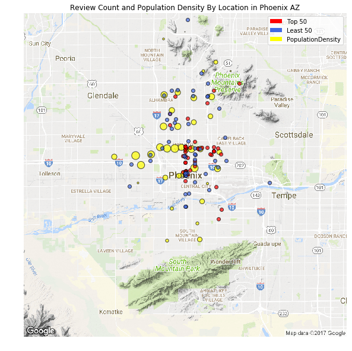


Stars


```python
centX,centY = latLonToPixelXY(centerLat,centerLon,scale)
plt.clf()
fig = plt.figure(figsize=(10, 10))
im = np.flipud(plt.imread(path+'phoenix.png'))
ax = plt.subplot(111)
ax.imshow(im, origin='lower')
```


    <matplotlib.image.AxesImage at 0x1fbe911dd68>


```python
for i in density_AZ.index:
    lat = density_AZ.loc[i,'latitude']
    lon = density_AZ.loc[i,'longitude']
    x,y = latLonToPixelXY(float(lat),float(lon),scale)
    x,y = size*pixelS/2 + x - centX,  size*pixelS/2 - (y - centY)
    ax.scatter(x,y,s=density_AZ.loc[i,'density']/50,facecolor='Yellow',lw=1,alpha=0.7,edgecolors='black')
```


```python
for i in Top_stars_AZ.index:
    lat = Top_stars_AZ.loc[i,'latitude']
    lon = Top_stars_AZ.loc[i,'longitude']
    x,y = latLonToPixelXY(float(lat),float(lon),scale)
    x,y = size*pixelS/2 + x - centX,  size*pixelS/2 - (y - centY)
    ax.scatter(x,y,facecolor='Red',lw=1,alpha=0.7,edgecolors='black')
```


```python
for i in Lea_stars_AZ.index:
    lat = Lea_stars_AZ.loc[i,'latitude']
    lon = Lea_stars_AZ.loc[i,'longitude']
    x,y = latLonToPixelXY(float(lat),float(lon),scale)
    x,y = size*pixelS/2 + x - centX,  size*pixelS/2 - (y - centY)
    ax.scatter(x,y,facecolor='RoyalBlue',lw=1,alpha=0.7,edgecolors='black')
```


```python
ax.set_xlim(0,size*pixelS)
ax.set_ylim(0,size*pixelS)
plt.legend(handles=[red_patch,blue_patch,yellow_patch])
ax.set(title = 'Stars and Population Density By Location in Phoenix AZ')
plt.axis('off')
plt.show()
```


    <matplotlib.figure.Figure at 0x1fbed2e33c8>


    <matplotlib.figure.Figure at 0x1fbed2e36d8>


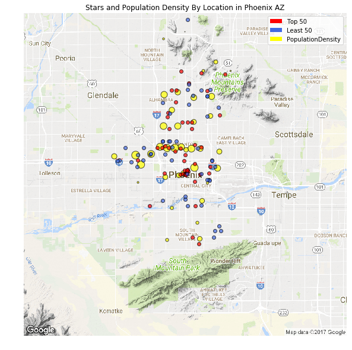


Check in


```python
centX,centY = latLonToPixelXY(centerLat,centerLon,scale)
fig = plt.figure(figsize=(10, 10))
im = np.flipud(plt.imread(path+'phoenix.png'))
ax = plt.subplot(111)
ax.imshow(im, origin='lower')
```


    <matplotlib.image.AxesImage at 0x1fbee79ab38>


```python
for i in density_AZ.index:
    lat = density_AZ.loc[i,'latitude']
    lon = density_AZ.loc[i,'longitude']
    x,y = latLonToPixelXY(float(lat),float(lon),scale)
    x,y = size*pixelS/2 + x - centX,  size*pixelS/2 - (y - centY)
    ax.scatter(x,y,s=density_AZ.loc[i,'density']/50,facecolor='Yellow',lw=1,alpha=0.7,edgecolors='black')
```


```python
for i in Top_checkin_AZ.index:
    lat = Top_checkin_AZ.loc[i,'latitude']
    lon = Top_checkin_AZ.loc[i,'longitude']
    x,y = latLonToPixelXY(float(lat),float(lon),scale)
    x,y = size*pixelS/2 + x - centX,  size*pixelS/2 - (y - centY)
    ax.scatter(x,y,facecolor='Red',lw=1,alpha=0.7,edgecolors='black')
```


```python
for i in Lea_checkin_AZ.index:
    lat = Lea_checkin_AZ.loc[i,'latitude']
    lon = Lea_checkin_AZ.loc[i,'longitude']
    x,y = latLonToPixelXY(float(lat),float(lon),scale)
    x,y = size*pixelS/2 + x - centX,  size*pixelS/2 - (y - centY)
    ax.scatter(x,y,facecolor='RoyalBlue',lw=1,alpha=0.7,edgecolors='black')
```


```python
ax.set_xlim(0,size*pixelS)
ax.set_ylim(0,size*pixelS)
plt.legend(handles=[red_patch,blue_patch,yellow_patch])
ax.set(title = 'Checkin and Population Density By Location in Phoenix AZ')
plt.axis('off')
plt.show()
```


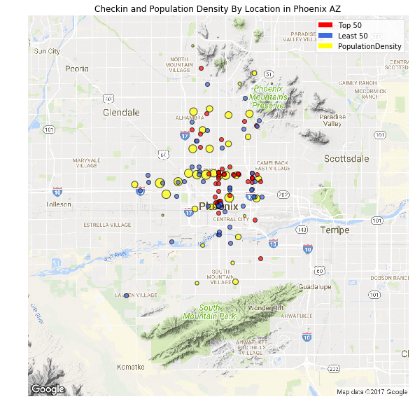


**Las Vegas NV**


```python
#Use geocoder to get information of latitude and longitude of Phoenix AZ. Sometimes it may not work. Please run it again.
g = geocoder.google('Las Vegas NV USA')
centerLat,centerLon = (g.lat, g.lng); scale = 11; pixelS = 2; size = 640
```


```python
#If error happens, it should be due to the code in last cell does not work.
Gmap(centerLat,centerLon,scale,pixelS,size,True, path+'lasvegas.png')
```

Review_count


```python
#If error happens, it should be due to the geocoding code does not work.
centX,centY = latLonToPixelXY(centerLat,centerLon,scale)
fig = plt.figure(figsize=(10, 10))
im = np.flipud(plt.imread(path+'lasvegas.png'))
ax = plt.subplot(111)
ax.imshow(im, origin='lower')
```


    <matplotlib.image.AxesImage at 0x1fbe586ab00>


```python
for i in density_NV.index:
    lat = density_NV.loc[i,'latitude']
    lon = density_NV.loc[i,'longitude']
    x,y = latLonToPixelXY(float(lat),float(lon),scale)
    x,y = size*pixelS/2 + x - centX,  size*pixelS/2 - (y - centY)
    ax.scatter(x,y,s=density_NV.loc[i,'density']/50,facecolor='Yellow',lw=1,alpha=0.7,edgecolors='black')
```


```python
for i in Top_review_NV.index:
    lat = Top_review_NV.loc[i,'latitude']
    lon = Top_review_NV.loc[i,'longitude']
    x,y = latLonToPixelXY(float(lat),float(lon),scale)
    x,y = size*pixelS/2 + x - centX,  size*pixelS/2 - (y - centY)
    ax.scatter(x,y,facecolor='Red',lw=1,alpha=0.7,edgecolors='black')
```


```python
for i in Lea_review_NV.index:
    lat = Lea_review_NV.loc[i,'latitude']
    lon = Lea_review_NV.loc[i,'longitude']
    x,y = latLonToPixelXY(float(lat),float(lon),scale)
    x,y = size*pixelS/2 + x - centX,  size*pixelS/2 - (y - centY)
    ax.scatter(x,y,facecolor='RoyalBlue',lw=1,alpha=0.7,edgecolors='black')
```


```python
ax.set_xlim(0,size*pixelS)
ax.set_ylim(0,size*pixelS)
plt.legend(handles=[red_patch,blue_patch,yellow_patch])
ax.set(title = 'Review Count and Population Density By Location in Las Vegas NV')
plt.axis('off')
plt.show()
```


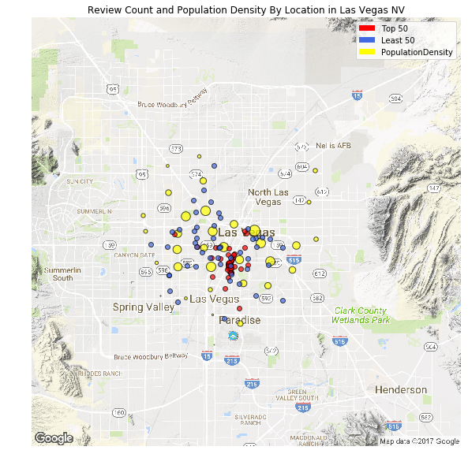


Stars


```python
centX,centY = latLonToPixelXY(centerLat,centerLon,scale)
fig = plt.figure(figsize=(10, 10))
im = np.flipud(plt.imread(path+'lasvegas.png'))
ax = plt.subplot(111)
ax.imshow(im, origin='lower')
```


    <matplotlib.image.AxesImage at 0x1fbeeb65898>


```python
for i in density_NV.index:
    lat = density_NV.loc[i,'latitude']
    lon = density_NV.loc[i,'longitude']
    x,y = latLonToPixelXY(float(lat),float(lon),scale)
    x,y = size*pixelS/2 + x - centX,  size*pixelS/2 - (y - centY)
    ax.scatter(x,y,s=density_NV.loc[i,'density']/50,facecolor='Yellow',lw=1,alpha=0.7,edgecolors='black')
```


```python
for i in Top_stars_NV.index:
    lat = Top_stars_NV.loc[i,'latitude']
    lon = Top_stars_NV.loc[i,'longitude']
    x,y = latLonToPixelXY(float(lat),float(lon),scale)
    x,y = size*pixelS/2 + x - centX,  size*pixelS/2 - (y - centY)
    ax.scatter(x,y,facecolor='Red',lw=1,alpha=0.7,edgecolors='black')
```


```python
for i in Lea_stars_NV.index:
    lat = Lea_stars_NV.loc[i,'latitude']
    lon = Lea_stars_NV.loc[i,'longitude']
    x,y = latLonToPixelXY(float(lat),float(lon),scale)
    x,y = size*pixelS/2 + x - centX,  size*pixelS/2 - (y - centY)
    ax.scatter(x,y,facecolor='RoyalBlue',lw=1,alpha=0.7,edgecolors='black')
```


```python
ax.set_xlim(0,size*pixelS)
ax.set_ylim(0,size*pixelS)
plt.legend(handles=[red_patch,blue_patch,yellow_patch])
ax.set(title = 'Stars and Population Density By Location in Las Veags NV')
plt.axis('off')
plt.show()
```


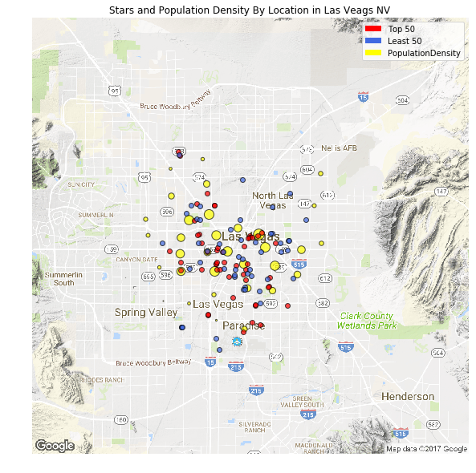


Check in


```python
centX,centY = latLonToPixelXY(centerLat,centerLon,scale)
fig = plt.figure(figsize=(10, 10))
im = np.flipud(plt.imread(path+'lasvegas.png'))
ax = plt.subplot(111)
ax.imshow(im, origin='lower')
```


    <matplotlib.image.AxesImage at 0x1fbf4bb4780>


```python
for i in density_NV.index:
    lat = density_NV.loc[i,'latitude']
    lon = density_NV.loc[i,'longitude']
    x,y = latLonToPixelXY(float(lat),float(lon),scale)
    x,y = size*pixelS/2 + x - centX,  size*pixelS/2 - (y - centY)
    ax.scatter(x,y,s=density_NV.loc[i,'density']/50,facecolor='Yellow',lw=1,alpha=0.7,edgecolors='black')
```


```python
for i in Top_checkin_NV.index:
    lat = Top_checkin_NV.loc[i,'latitude']
    lon = Top_checkin_NV.loc[i,'longitude']
    x,y = latLonToPixelXY(float(lat),float(lon),scale)
    x,y = size*pixelS/2 + x - centX,  size*pixelS/2 - (y - centY)
    ax.scatter(x,y,facecolor='Red',lw=1,alpha=0.7,edgecolors='black')
```


```python
for i in Lea_checkin_NV.index:
    lat = Lea_checkin_NV.loc[i,'latitude']
    lon = Lea_checkin_NV.loc[i,'longitude']
    x,y = latLonToPixelXY(float(lat),float(lon),scale)
    x,y = size*pixelS/2 + x - centX,  size*pixelS/2 - (y - centY)
    ax.scatter(x,y,facecolor='RoyalBlue',lw=1,alpha=0.7,edgecolors='black')
```


```python
ax.set_xlim(0,size*pixelS)
ax.set_ylim(0,size*pixelS)
plt.legend(handles=[red_patch,blue_patch,yellow_patch])
ax.set(title = 'Checkin and Population Density By Location in Las Vegas NV')
plt.axis('off')
plt.show()
```


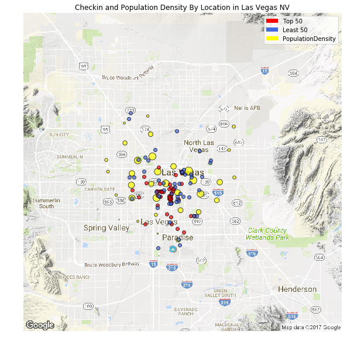


### Regression Model


```python
from pandas.io.json import json_normalize
import json
```


```python
import pandas as pd
import numpy as np
import matplotlib.pyplot as plt
%matplotlib inline
```


```python
fn = 'c:/business.json'
```


```python
s=[]
for line in open(fn, 'r'):
    s.append(json.loads(line))
```


```python
len(s)
```


    156639


```python
s[0]
```


    {'address': '691 Richmond Rd',
     'attributes': {'BikeParking': True,
      'BusinessParking': {'garage': False,
       'lot': True,
       'street': False,
       'valet': False,
       'validated': False},
      'RestaurantsPriceRange2': 2,
      'WheelchairAccessible': True},
     'business_id': 'YDf95gJZaq05wvo7hTQbbQ',
     'categories': ['Shopping', 'Shopping Centers'],
     'city': 'Richmond Heights',
     'hours': {'Friday': '10:00-21:00',
      'Monday': '10:00-21:00',
      'Saturday': '10:00-21:00',
      'Sunday': '11:00-18:00',
      'Thursday': '10:00-21:00',
      'Tuesday': '10:00-21:00',
      'Wednesday': '10:00-21:00'},
     'is_open': 1,
     'latitude': 41.5417162,
     'longitude': -81.4931165,
     'name': 'Richmond Town Square',
     'neighborhood': '',
     'postal_code': '44143',
     'review_count': 17,
     'stars': 2.0,
     'state': 'OH'}


```python
df1 = pd.DataFrame.from_dict(json_normalize(s), orient='columns')
```


```python
df1.head(5)
```


<div>
<style>
    .dataframe thead tr:only-child th {
        text-align: right;
    }

    .dataframe thead th {
        text-align: left;
    }

    .dataframe tbody tr th {
        vertical-align: top;
    }
</style>
<table border="1" class="dataframe">
  <thead>
    <tr style="text-align: right;">
      <th></th>
      <th>address</th>
      <th>attributes.AcceptsInsurance</th>
      <th>attributes.AgesAllowed</th>
      <th>attributes.Alcohol</th>
      <th>attributes.Ambience.casual</th>
      <th>attributes.Ambience.classy</th>
      <th>attributes.Ambience.divey</th>
      <th>attributes.Ambience.hipster</th>
      <th>attributes.Ambience.intimate</th>
      <th>attributes.Ambience.romantic</th>
      <th>...</th>
      <th>hours.Wednesday</th>
      <th>is_open</th>
      <th>latitude</th>
      <th>longitude</th>
      <th>name</th>
      <th>neighborhood</th>
      <th>postal_code</th>
      <th>review_count</th>
      <th>stars</th>
      <th>state</th>
    </tr>
  </thead>
  <tbody>
    <tr>
      <th>0</th>
      <td>691 Richmond Rd</td>
      <td>NaN</td>
      <td>NaN</td>
      <td>NaN</td>
      <td>NaN</td>
      <td>NaN</td>
      <td>NaN</td>
      <td>NaN</td>
      <td>NaN</td>
      <td>NaN</td>
      <td>...</td>
      <td>10:00-21:00</td>
      <td>1</td>
      <td>41.541716</td>
      <td>-81.493116</td>
      <td>Richmond Town Square</td>
      <td></td>
      <td>44143</td>
      <td>17</td>
      <td>2.0</td>
      <td>OH</td>
    </tr>
    <tr>
      <th>1</th>
      <td>2824 Milton Rd</td>
      <td>NaN</td>
      <td>NaN</td>
      <td>NaN</td>
      <td>False</td>
      <td>False</td>
      <td>False</td>
      <td>False</td>
      <td>False</td>
      <td>False</td>
      <td>...</td>
      <td>10:00-22:00</td>
      <td>0</td>
      <td>35.236870</td>
      <td>-80.741976</td>
      <td>South Florida Style Chicken &amp; Ribs</td>
      <td>Eastland</td>
      <td>28215</td>
      <td>4</td>
      <td>4.5</td>
      <td>NC</td>
    </tr>
    <tr>
      <th>2</th>
      <td>337 Danforth Avenue</td>
      <td>NaN</td>
      <td>NaN</td>
      <td>NaN</td>
      <td>NaN</td>
      <td>NaN</td>
      <td>NaN</td>
      <td>NaN</td>
      <td>NaN</td>
      <td>NaN</td>
      <td>...</td>
      <td>10:00-19:00</td>
      <td>0</td>
      <td>43.677126</td>
      <td>-79.353285</td>
      <td>The Tea Emporium</td>
      <td>Riverdale</td>
      <td>M4K 1N7</td>
      <td>7</td>
      <td>4.5</td>
      <td>ON</td>
    </tr>
    <tr>
      <th>3</th>
      <td>7702 E Doubletree Ranch Rd, Ste 300</td>
      <td>NaN</td>
      <td>NaN</td>
      <td>NaN</td>
      <td>NaN</td>
      <td>NaN</td>
      <td>NaN</td>
      <td>NaN</td>
      <td>NaN</td>
      <td>NaN</td>
      <td>...</td>
      <td>9:00-17:00</td>
      <td>1</td>
      <td>33.565082</td>
      <td>-111.916400</td>
      <td>TRUmatch</td>
      <td></td>
      <td>85258</td>
      <td>3</td>
      <td>3.0</td>
      <td>AZ</td>
    </tr>
    <tr>
      <th>4</th>
      <td>4719 N 20Th St</td>
      <td>NaN</td>
      <td>NaN</td>
      <td>none</td>
      <td>False</td>
      <td>False</td>
      <td>False</td>
      <td>False</td>
      <td>False</td>
      <td>False</td>
      <td>...</td>
      <td>NaN</td>
      <td>0</td>
      <td>33.505928</td>
      <td>-112.038847</td>
      <td>Blimpie</td>
      <td></td>
      <td>85016</td>
      <td>10</td>
      <td>4.5</td>
      <td>AZ</td>
    </tr>
  </tbody>
</table>
<p>5 rows × 101 columns</p>
</div>


```python
df2=df1.dropna(axis=1,thresh=39159)
```


```python
df2.head()
```


<div>
<style>
    .dataframe thead tr:only-child th {
        text-align: right;
    }

    .dataframe thead th {
        text-align: left;
    }

    .dataframe tbody tr th {
        vertical-align: top;
    }
</style>
<table border="1" class="dataframe">
  <thead>
    <tr style="text-align: right;">
      <th></th>
      <th>address</th>
      <th>attributes.Alcohol</th>
      <th>attributes.Ambience.casual</th>
      <th>attributes.Ambience.classy</th>
      <th>attributes.Ambience.hipster</th>
      <th>attributes.Ambience.intimate</th>
      <th>attributes.Ambience.romantic</th>
      <th>attributes.Ambience.touristy</th>
      <th>attributes.Ambience.trendy</th>
      <th>attributes.Ambience.upscale</th>
      <th>...</th>
      <th>hours.Wednesday</th>
      <th>is_open</th>
      <th>latitude</th>
      <th>longitude</th>
      <th>name</th>
      <th>neighborhood</th>
      <th>postal_code</th>
      <th>review_count</th>
      <th>stars</th>
      <th>state</th>
    </tr>
  </thead>
  <tbody>
    <tr>
      <th>0</th>
      <td>691 Richmond Rd</td>
      <td>NaN</td>
      <td>NaN</td>
      <td>NaN</td>
      <td>NaN</td>
      <td>NaN</td>
      <td>NaN</td>
      <td>NaN</td>
      <td>NaN</td>
      <td>NaN</td>
      <td>...</td>
      <td>10:00-21:00</td>
      <td>1</td>
      <td>41.541716</td>
      <td>-81.493116</td>
      <td>Richmond Town Square</td>
      <td></td>
      <td>44143</td>
      <td>17</td>
      <td>2.0</td>
      <td>OH</td>
    </tr>
    <tr>
      <th>1</th>
      <td>2824 Milton Rd</td>
      <td>NaN</td>
      <td>False</td>
      <td>False</td>
      <td>False</td>
      <td>False</td>
      <td>False</td>
      <td>False</td>
      <td>False</td>
      <td>False</td>
      <td>...</td>
      <td>10:00-22:00</td>
      <td>0</td>
      <td>35.236870</td>
      <td>-80.741976</td>
      <td>South Florida Style Chicken &amp; Ribs</td>
      <td>Eastland</td>
      <td>28215</td>
      <td>4</td>
      <td>4.5</td>
      <td>NC</td>
    </tr>
    <tr>
      <th>2</th>
      <td>337 Danforth Avenue</td>
      <td>NaN</td>
      <td>NaN</td>
      <td>NaN</td>
      <td>NaN</td>
      <td>NaN</td>
      <td>NaN</td>
      <td>NaN</td>
      <td>NaN</td>
      <td>NaN</td>
      <td>...</td>
      <td>10:00-19:00</td>
      <td>0</td>
      <td>43.677126</td>
      <td>-79.353285</td>
      <td>The Tea Emporium</td>
      <td>Riverdale</td>
      <td>M4K 1N7</td>
      <td>7</td>
      <td>4.5</td>
      <td>ON</td>
    </tr>
    <tr>
      <th>3</th>
      <td>7702 E Doubletree Ranch Rd, Ste 300</td>
      <td>NaN</td>
      <td>NaN</td>
      <td>NaN</td>
      <td>NaN</td>
      <td>NaN</td>
      <td>NaN</td>
      <td>NaN</td>
      <td>NaN</td>
      <td>NaN</td>
      <td>...</td>
      <td>9:00-17:00</td>
      <td>1</td>
      <td>33.565082</td>
      <td>-111.916400</td>
      <td>TRUmatch</td>
      <td></td>
      <td>85258</td>
      <td>3</td>
      <td>3.0</td>
      <td>AZ</td>
    </tr>
    <tr>
      <th>4</th>
      <td>4719 N 20Th St</td>
      <td>none</td>
      <td>False</td>
      <td>False</td>
      <td>False</td>
      <td>False</td>
      <td>False</td>
      <td>False</td>
      <td>False</td>
      <td>False</td>
      <td>...</td>
      <td>NaN</td>
      <td>0</td>
      <td>33.505928</td>
      <td>-112.038847</td>
      <td>Blimpie</td>
      <td></td>
      <td>85016</td>
      <td>10</td>
      <td>4.5</td>
      <td>AZ</td>
    </tr>
  </tbody>
</table>
<p>5 rows × 55 columns</p>
</div>


```python
del df2["address"]
del df2["business_id"]
del df2["categories"]
del df2["city"]
del df2["hours.Friday"]
del df2["hours.Monday"]
del df2["hours.Saturday"]
del df2["hours.Sunday"]
del df2["hours.Thursday"]
del df2["hours.Tuesday"]
del df2["hours.Wednesday"]
del df2["is_open"]
del df2["latitude"]
del df2["longitude"]
del df2["name"]
del df2["neighborhood"]
del df2["postal_code"]
del df2["state"]
```


```python
df2.head()
```


<div>
<style>
    .dataframe thead tr:only-child th {
        text-align: right;
    }

    .dataframe thead th {
        text-align: left;
    }

    .dataframe tbody tr th {
        vertical-align: top;
    }
</style>
<table border="1" class="dataframe">
  <thead>
    <tr style="text-align: right;">
      <th></th>
      <th>attributes.Alcohol</th>
      <th>attributes.Ambience.casual</th>
      <th>attributes.Ambience.classy</th>
      <th>attributes.Ambience.hipster</th>
      <th>attributes.Ambience.intimate</th>
      <th>attributes.Ambience.romantic</th>
      <th>attributes.Ambience.touristy</th>
      <th>attributes.Ambience.trendy</th>
      <th>attributes.Ambience.upscale</th>
      <th>attributes.BikeParking</th>
      <th>...</th>
      <th>attributes.RestaurantsDelivery</th>
      <th>attributes.RestaurantsGoodForGroups</th>
      <th>attributes.RestaurantsPriceRange2</th>
      <th>attributes.RestaurantsReservations</th>
      <th>attributes.RestaurantsTableService</th>
      <th>attributes.RestaurantsTakeOut</th>
      <th>attributes.WheelchairAccessible</th>
      <th>attributes.WiFi</th>
      <th>review_count</th>
      <th>stars</th>
    </tr>
  </thead>
  <tbody>
    <tr>
      <th>0</th>
      <td>NaN</td>
      <td>NaN</td>
      <td>NaN</td>
      <td>NaN</td>
      <td>NaN</td>
      <td>NaN</td>
      <td>NaN</td>
      <td>NaN</td>
      <td>NaN</td>
      <td>True</td>
      <td>...</td>
      <td>NaN</td>
      <td>NaN</td>
      <td>2.0</td>
      <td>NaN</td>
      <td>NaN</td>
      <td>NaN</td>
      <td>True</td>
      <td>NaN</td>
      <td>17</td>
      <td>2.0</td>
    </tr>
    <tr>
      <th>1</th>
      <td>NaN</td>
      <td>False</td>
      <td>False</td>
      <td>False</td>
      <td>False</td>
      <td>False</td>
      <td>False</td>
      <td>False</td>
      <td>False</td>
      <td>NaN</td>
      <td>...</td>
      <td>True</td>
      <td>True</td>
      <td>2.0</td>
      <td>False</td>
      <td>NaN</td>
      <td>True</td>
      <td>NaN</td>
      <td>NaN</td>
      <td>4</td>
      <td>4.5</td>
    </tr>
    <tr>
      <th>2</th>
      <td>NaN</td>
      <td>NaN</td>
      <td>NaN</td>
      <td>NaN</td>
      <td>NaN</td>
      <td>NaN</td>
      <td>NaN</td>
      <td>NaN</td>
      <td>NaN</td>
      <td>True</td>
      <td>...</td>
      <td>NaN</td>
      <td>NaN</td>
      <td>2.0</td>
      <td>NaN</td>
      <td>NaN</td>
      <td>NaN</td>
      <td>True</td>
      <td>no</td>
      <td>7</td>
      <td>4.5</td>
    </tr>
    <tr>
      <th>3</th>
      <td>NaN</td>
      <td>NaN</td>
      <td>NaN</td>
      <td>NaN</td>
      <td>NaN</td>
      <td>NaN</td>
      <td>NaN</td>
      <td>NaN</td>
      <td>NaN</td>
      <td>NaN</td>
      <td>...</td>
      <td>NaN</td>
      <td>NaN</td>
      <td>NaN</td>
      <td>NaN</td>
      <td>NaN</td>
      <td>NaN</td>
      <td>NaN</td>
      <td>NaN</td>
      <td>3</td>
      <td>3.0</td>
    </tr>
    <tr>
      <th>4</th>
      <td>none</td>
      <td>False</td>
      <td>False</td>
      <td>False</td>
      <td>False</td>
      <td>False</td>
      <td>False</td>
      <td>False</td>
      <td>False</td>
      <td>True</td>
      <td>...</td>
      <td>False</td>
      <td>True</td>
      <td>1.0</td>
      <td>False</td>
      <td>False</td>
      <td>True</td>
      <td>NaN</td>
      <td>no</td>
      <td>10</td>
      <td>4.5</td>
    </tr>
  </tbody>
</table>
<p>5 rows × 37 columns</p>
</div>


```python
df3=df2.dropna(thresh=18)
```


```python
df3.head()
```


<div>
<style>
    .dataframe thead tr:only-child th {
        text-align: right;
    }

    .dataframe thead th {
        text-align: left;
    }

    .dataframe tbody tr th {
        vertical-align: top;
    }
</style>
<table border="1" class="dataframe">
  <thead>
    <tr style="text-align: right;">
      <th></th>
      <th>attributes.Alcohol</th>
      <th>attributes.Ambience.casual</th>
      <th>attributes.Ambience.classy</th>
      <th>attributes.Ambience.hipster</th>
      <th>attributes.Ambience.intimate</th>
      <th>attributes.Ambience.romantic</th>
      <th>attributes.Ambience.touristy</th>
      <th>attributes.Ambience.trendy</th>
      <th>attributes.Ambience.upscale</th>
      <th>attributes.BikeParking</th>
      <th>...</th>
      <th>attributes.RestaurantsDelivery</th>
      <th>attributes.RestaurantsGoodForGroups</th>
      <th>attributes.RestaurantsPriceRange2</th>
      <th>attributes.RestaurantsReservations</th>
      <th>attributes.RestaurantsTableService</th>
      <th>attributes.RestaurantsTakeOut</th>
      <th>attributes.WheelchairAccessible</th>
      <th>attributes.WiFi</th>
      <th>review_count</th>
      <th>stars</th>
    </tr>
  </thead>
  <tbody>
    <tr>
      <th>1</th>
      <td>NaN</td>
      <td>False</td>
      <td>False</td>
      <td>False</td>
      <td>False</td>
      <td>False</td>
      <td>False</td>
      <td>False</td>
      <td>False</td>
      <td>NaN</td>
      <td>...</td>
      <td>True</td>
      <td>True</td>
      <td>2.0</td>
      <td>False</td>
      <td>NaN</td>
      <td>True</td>
      <td>NaN</td>
      <td>NaN</td>
      <td>4</td>
      <td>4.5</td>
    </tr>
    <tr>
      <th>4</th>
      <td>none</td>
      <td>False</td>
      <td>False</td>
      <td>False</td>
      <td>False</td>
      <td>False</td>
      <td>False</td>
      <td>False</td>
      <td>False</td>
      <td>True</td>
      <td>...</td>
      <td>False</td>
      <td>True</td>
      <td>1.0</td>
      <td>False</td>
      <td>False</td>
      <td>True</td>
      <td>NaN</td>
      <td>no</td>
      <td>10</td>
      <td>4.5</td>
    </tr>
    <tr>
      <th>14</th>
      <td>full_bar</td>
      <td>False</td>
      <td>False</td>
      <td>False</td>
      <td>False</td>
      <td>False</td>
      <td>False</td>
      <td>False</td>
      <td>False</td>
      <td>True</td>
      <td>...</td>
      <td>False</td>
      <td>True</td>
      <td>2.0</td>
      <td>False</td>
      <td>False</td>
      <td>True</td>
      <td>NaN</td>
      <td>free</td>
      <td>21</td>
      <td>2.0</td>
    </tr>
    <tr>
      <th>21</th>
      <td>none</td>
      <td>False</td>
      <td>False</td>
      <td>False</td>
      <td>False</td>
      <td>False</td>
      <td>False</td>
      <td>False</td>
      <td>False</td>
      <td>True</td>
      <td>...</td>
      <td>False</td>
      <td>False</td>
      <td>1.0</td>
      <td>False</td>
      <td>True</td>
      <td>True</td>
      <td>NaN</td>
      <td>no</td>
      <td>15</td>
      <td>3.0</td>
    </tr>
    <tr>
      <th>25</th>
      <td>full_bar</td>
      <td>False</td>
      <td>False</td>
      <td>False</td>
      <td>False</td>
      <td>False</td>
      <td>False</td>
      <td>False</td>
      <td>False</td>
      <td>True</td>
      <td>...</td>
      <td>NaN</td>
      <td>True</td>
      <td>2.0</td>
      <td>NaN</td>
      <td>NaN</td>
      <td>NaN</td>
      <td>False</td>
      <td>NaN</td>
      <td>14</td>
      <td>4.0</td>
    </tr>
  </tbody>
</table>
<p>5 rows × 37 columns</p>
</div>


```python
#find Number of nan in every attributes
from __future__ import division
print (df3.shape)
df3.isnull().sum(axis=0)/df3.shape[0]
#results show a lot of nan value
```

    (46943, 37)
    


    attributes.Alcohol                       0.098843
    attributes.Ambience.casual               0.096564
    attributes.Ambience.classy               0.096564
    attributes.Ambience.hipster              0.097033
    attributes.Ambience.intimate             0.096564
    attributes.Ambience.romantic             0.096564
    attributes.Ambience.touristy             0.096564
    attributes.Ambience.trendy               0.096564
    attributes.Ambience.upscale              0.096564
    attributes.BikeParking                   0.231004
    attributes.BusinessAcceptsCreditCards    0.050913
    attributes.BusinessParking.garage        0.091877
    attributes.BusinessParking.lot           0.091877
    attributes.BusinessParking.street        0.091877
    attributes.BusinessParking.valet         0.091877
    attributes.BusinessParking.validated     0.115118
    attributes.GoodForKids                   0.089215
    attributes.GoodForMeal.breakfast         0.110517
    attributes.GoodForMeal.brunch            0.110517
    attributes.GoodForMeal.dessert           0.110517
    attributes.GoodForMeal.dinner            0.110517
    attributes.GoodForMeal.latenight         0.110517
    attributes.GoodForMeal.lunch             0.110517
    attributes.HasTV                         0.097885
    attributes.NoiseLevel                    0.155210
    attributes.OutdoorSeating                0.041944
    attributes.RestaurantsAttire             0.093113
    attributes.RestaurantsDelivery           0.111540
    attributes.RestaurantsGoodForGroups      0.028630
    attributes.RestaurantsPriceRange2        0.008223
    attributes.RestaurantsReservations       0.076944
    attributes.RestaurantsTableService       0.171165
    attributes.RestaurantsTakeOut            0.085018
    attributes.WheelchairAccessible          0.529685
    attributes.WiFi                          0.250580
    review_count                             0.000000
    stars                                    0.000000
    dtype: float64


```python
from sklearn.preprocessing import LabelEncoder

#use -1 to make missing value a separate category
df3.fillna(-1, inplace=True)

le = LabelEncoder()
for col in df3.columns:
    df3.loc[:, col] = le.fit_transform(df3.loc[:, col].astype(str))
```

    C:\Anaconda\lib\site-packages\pandas\core\frame.py:2852: SettingWithCopyWarning:
    
    
    A value is trying to be set on a copy of a slice from a DataFrame
    
    See the caveats in the documentation: http://pandas.pydata.org/pandas-docs/stable/indexing.html#indexing-view-versus-copy
    
    C:\Anaconda\lib\site-packages\pandas\core\indexing.py:517: SettingWithCopyWarning:
    
    
    A value is trying to be set on a copy of a slice from a DataFrame.
    Try using .loc[row_indexer,col_indexer] = value instead
    
    See the caveats in the documentation: http://pandas.pydata.org/pandas-docs/stable/indexing.html#indexing-view-versus-copy
    
    


```python
from sklearn.model_selection import StratifiedKFold,cross_val_score
from sklearn import linear_model, ensemble

skf = StratifiedKFold(n_splits=3)

rfc = ensemble.RandomForestClassifier(n_estimators=100, criterion='entropy', 
                                      max_depth=None, min_samples_split=2, 
                                      min_samples_leaf=4, 
                                      min_weight_fraction_leaf=0.0, 
                                      max_features='auto', 
                                      max_leaf_nodes=None, 
                                      bootstrap=True, 
                                      oob_score=False, 
                                      n_jobs=1)

for train_index, test_index in skf.split(df3.iloc[:, :-1], 
                le.fit_transform(df3.iloc[:, -1])):
    rfc.fit(df3.iloc[train_index, :-1], 
            df3.iloc[train_index, -1])
    print (rfc.score(df3.iloc[test_index, :-1], 
            df3.iloc[test_index, -1]))
```

    0.297022744697
    0.30029396728
    0.294700505018
    


```python
fig = plt.figure(figsize=(10,10))
plt.barh(range(df3.shape[1]-1) ,rfc.feature_importances_,
        tick_label=df3.columns[:-1])
```


    <Container object of 36 artists>


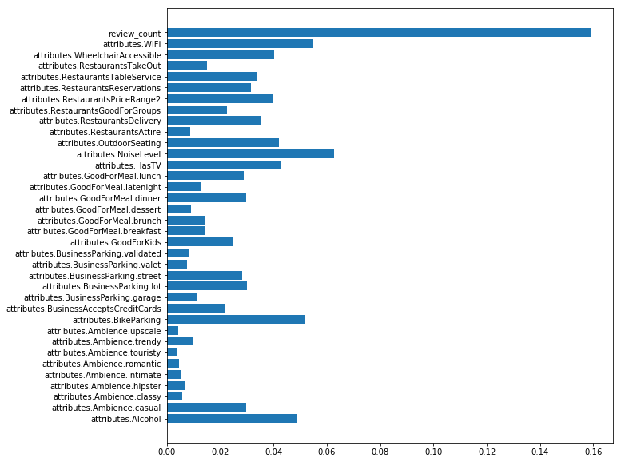


The result above shows that the Wifi, Noise Level, Bike Parking and alcohol are important factors.
